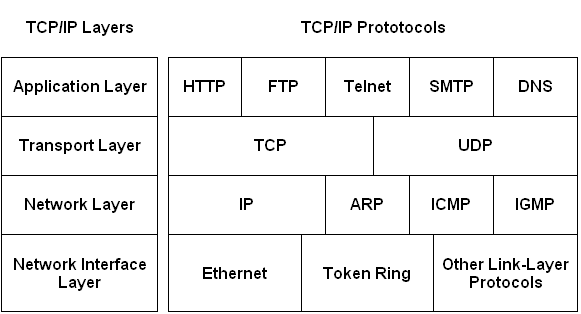

# Application layer


## Server Client 

In a **client-server architecture** , there is an always-on host, called the server, which services requests
from many other hosts, called clients.  Page 118


## P2P

**Peer-to-peer** (**P2P**) computing or networking is a [distributed application](https://en.wikipedia.org/wiki/Distributed_application) architecture that partitions tasks or workloads between peers. [P2P](https://en.wikipedia.org/wiki/Peer-to-peer). Peers make a portion of their resources, such as processing power, disk storage or network bandwidth, directly available to other network participants, without the need for central coordination by servers or stable hosts.[[1\]](https://en.wikipedia.org/wiki/Peer-to-peer#cite_note-1) Peers are both suppliers and consumers of resources, in contrast to the traditional [client-server](https://en.wikipedia.org/wiki/Client-server) model in which the consumption and supply of resources is divided.  


## Protocols in different Layer



## Port

A **port** is a communication endpoint. At the software level a port is a logical construct that **identifies a specific process**. [Port](https://en.wikipedia.org/wiki/Port_(computer_networking)) This information is needed because in general a host could be running many network applications.  Page 119


## Socket

A process sends messages into, and receives messages from, the network through a software interface called a socket. A process is analogous to a house and its socket is analogous to its door. Page 119.

## HTTP

The Web's applications protocol, HTTP, defines the format and sequence of messages exchanged between browsers and Web Server. HTTP is only one piece of the Web application. Page 126

- Stateless
- Uses `TCP/IP`
- Message types:
	+ **HTTP request message**
	+ **HTTP response message**
- HTTP/2
	- Allows objects in a persistent connection to be sent in a client-specified priority order
	- Allows a large object to be broken down into smaller pieces, and the transmission of thsose pieces to be interleaved with transmission other smaller objects, thus preventing a large object from forcing many smaller objects to wait their turn for transmission. 


## Conditional HTTP GET

- Used to allow a server to only send the requested object to the client if that object has changed since the server last sent this object to the client.
- An HTTP request message is a so-called conditional GET message if (1) the request message uses the
  GET method and (2) the request message includes an `If-Modified-Since`: header line.

```
GET /fruit/kiwi.gif HTTP/1.1
Host: www.exotiquecuisine.com
If-modified-since: Wed, 9 Sep 2015 09:23:24
```


## Last modified

- `Last-Modified` header is critical for object caching, both in the local client and in network cache servers(also known as proxy servers)

- Alternative `Etag` -  ETag values are unique identifiers generated by the server and changed every time the object is modified. 


## Persistent vs Non-persistent

When this client-server interaction is taking place over TCP, the application developer needs to make an important decision—should each request/response pair be sent over a separate TCP connection, or should all of the requests and their corresponding responses be sent over the same TCP connection?

| Persistent                                                   | Non persistent                                               |
| ------------------------------------------------------------ | ------------------------------------------------------------ |
| All of the request and their corresponding responses is sent over the same TCP connection | Each request/response pair is sent over separate TCP connection |


## Cookies

Cookies allows sites to keep track of users.  Cookie technology has four components:

1. A cookie header line in the HTTP response message.
2. A cookie header line in the HTTP request message.
3. A cookie file kelp on the user's end system and managed by the user's browser.
4. A back-end database at the Website


Page 139


## Cache/Proxy Server

A Web cache - also called a proxy server - is a network entity that satisfies HTTP requests on the behalf of an origin Web server. The web cache has its own disk storage and keeps copies of recently requested objects in this storage. Web cache can substantially reduce the response time for a client request Web caches can substantially reduce traffic on an institution access link to the Internet.  Page 143


## What are the 4 aspects of data reliability?
- A reliable service is one that notifies the user if delivery fails, while an unreliable one does not notify the user if delivery fails
- All data is sent (no missing or duplicates bytes)
- The proper order
Page 123
## What is a server?
A host, which services requests from many other hosts, called clients. Page 115


## How does caching work?

1. The browser establishes a TCP connection to the Web cache and sends an HTTP request for the object to the Web cache.
2. The web cache checks to see if it has a copy o the object stored locally. If it does, the Web cache returns the object within an HTTP reposnse message to the client browser
3. If the cache does not have the object, the Web cache opens TCP connection to the origin server. The Web cache then sends an HTTP request for the object into the cache-to-server TCP connection. After receiving this request, the origin server sends the object within an HTTP response to the Web cache. 
4. When the Web cache receives the object, it stores a copy in its local storage and sends a copy, within an HTTP response message, to the client browser(over the existing TCP connection between the client browser and the Web cache). 


## SMTP

SMTP **Simple Mail Transfer Protocol** (**SMTP**)  is the principal application-layer protocol for Internet electronic mail. It uses the reliable data transfer service of **TCP to transfer mail** from sender's mail server to the recipient's mail server. Page 149

- SMTP is a push protocol

## SMTP vs HTTP

| Parameter              | HTTP                                | SMTP                                              |
| ---------------------- | ----------------------------------- | ------------------------------------------------- |
| Port number            | 80                                  | 25                                                |
| State                  | Stateless                           | -                                                 |
| Type of TCP connection | Persistent or Non-persistent        | Persistent                                        |
| Type of protocol       | Pull Protocol(mainly)               | Push Protocol                                     |
| Transfer               | Files from Web server to Web client | Files from one mail server to another mail server |


### IMAP and POP3

A user agent can’t use SMTP to obtain the messages because obtaining the messages is a pull operation, whereas SMTP is a push protocol. The puzzle is completed by introducing a special mail access protocol that transfers messages from a mail server to his local PC. There are currently a number of popular mail access protocols, including Post Office Protocol—Version 3 (POP3), Internet Mail Access Protocol (IMAP), and HTTP.

With POP3 access, once a user has downloaded his messages to the local machine, he can create mail folders and move the downloaded messages into the folders. A user can then delete messages, move messages across folders, and search for messages (by sender name or subject). But this paradigm— namely, folders and messages in the local machine—poses a problem for the nomadic user, who would prefer to maintain a folder hierarchy on a remote server that can be accessed from any computer. This is not possible with POP3—the POP3 protocol does not provide any means for a user to create remote folders and assign messages to folders. So nothing is synchronized. 

IMAP was designed with the goal of permitting complete management of an email box by multiple email clients, therefore clients generally leave messages on the server until the user explicitly deletes them.  All emails and folders are synchronized between multiple devices.  


## Stateless protocol
In computing, a stateless protocol is a communications protocol in which no session information is retained by the receiver, usually a server. [Stateless protocol](https://en.wikipedia.org/wiki/Stateless_protocol#:~:text=In%20computing%2C%20a%20stateless%20protocol,the%20receiver%2C%20usually%20a%20server.)


## CDN

- A content delivery network (CDN) refers to a geographically distributed group of **proxy servers** which work together to provide fast delivery of Internet content. Thus, CDN caches content (such as images, videos, or webpages) in proxy servers. So a **company deploy CDN infrastructure** with **many groups of servers**.  In one world, **distributed caches**
- **CDN does:**
  - **Manages** servers in multiple geographically distributed locations
  - **Stores** copies of the content in its servers
  - **Directs** each user request to location that will provide the best user experience.  
- **Why not only one enormous data center?** 
  - If the client is far away from data center, server-to-client packets will cross many communication links, resulting huge delays for the user
  - Same content will be likely sent many times over the same communication links
  - A single data center represents a single point of failure(although a center center is crashed, the content could be received from one cache servers)

- **Benefits**
  - Minimized **latency**
  - CDNs can offer instant user redirections, they can assure 100 percent server **availability** even in the event of power failures or when there are any network and hardware issue associated with the system 
  - AWS offers advanced CDN with computations at edge, dynamic content maintain **secure** connections close to the requestor, firewal, protection from DDoS [CDN AWS](https://aws.amazon.com/caching/cdn/)
- **Drawbacks**
  - CDN network contains most updated static data. Hence, you may find difficulties in application development. In other words, to preview latest changes you made, you will need Internet connection as you won’t have a local copy. This could be a headache for non technical writer or Blogger.
  - Since your static content will be served from other sources, CDN demands additional DNS lookup.
  - Using CDN, you are creating additional “point of failure”. If the CDN network goes down you may lose website visibility.
  - [Drawback CDN ](https://www.accuwebhosting.com/blog/cdn-pros-cons-explained/#:~:text=CDN%20Drawbacks&text=It%20don't%20seem%20much,copied%20to%20all%20distributed%20servers.)
- **Use cases:**
  - Video streaming workloads benefit significantly from a content-distribution network(CDN) across multiple data centers and edges points 

| Private CDN                                  | Third-party CDN                                             |
| -------------------------------------------- | ----------------------------------------------------------- |
| Owned by the content provider itiself        | Distributed content on behalf of multiple content providers |
| E.g. Google's CDN distributes YouTube videos | Akamai, Limelight operate third-party CDN                   |

- **CDNs typically adopt one of two different server placement philosophies: enter deep or bring home**

|            | Enter deep                                                   | Bring home                                                   |
| ---------- | ------------------------------------------------------------ | ------------------------------------------------------------ |
| Philosophy | Enter deep into the access networks of ISPs. Get close to end users | Instead of getting inside the access ISP, these CDNs typically place their clusters in IXPs |
| Advantages | Improves user-perceived delay and throughput by decreasing the number of links and routers between the end user and the CDN server from which it receives content | Lower maintenance and management overhead                    |
| Disadv.    | maintain and manage the clusters can become challenging because of this highly distributed design | higher delay and lower throughput to end users               |

- **How it operates**
  - Most CDNs take advantage of DNS to intercept and redirect requests; 
  - CDN learns the IP address of the client’s local DNS (LDNS) server via the client’s DNS lookup. After learning this IP address, the CDN needs to select an appropriate cluster based on this IP address. CDNs generally employ proprietary cluster selection strategies: geographically closest or by performing real-time measurements of delay and loss performance. 
  - *My thoughts*:  if client updates anything so it updates at origin server, CDN used only for fetching content. So the user fetches first the content from CDN server and if he/she needs update anything it updates direct to orgin server(the address could still be CDN server, but it will redirect to origin server)

- **Google' CDN - three tiers of server clusters**


- **Netflix**


- 

## Enter deep

a CDN approach that stores content in access networks, close to clients

## Centralized architecture vs distributed architecture

- **Security**:
  - CENTRALIZED: If someone has access to the server with the information, any data can be added, modified and deleted.
  - DISTRIBUTED: All data is distributed between the nodes of the network. If something is added, edited or deleted in any computer, it will be reflected in all the computers in the network. If some legal amendments are accepted, new information will be disseminated among other users throughout the network. Otherwise, the data will be copied to match the other nodes. Therefore, the system is self-sufficient and self-regulating. The databases are protected against deliberate attacks or accidental changes of information.
- **Availability**:
  - CENTRALIZED: If there are several requests, the server can break down and no longer respond.
  - DISTRIBUTED: Can withstand significant pressure on the network. All the nodes in the network have the data. Then, the requests are distributed among the nodes. Therefore, the pressure does not fall on a computer, but on the entire network. In this case, the total availability of the network is much greater than in the centralized one.
- **Accessibility**:
  - CENTRALIZED: If the central storage has problems, you will not be able to obtain your information unless the problems are solved. In addition, different users have different needs, but the processes are standardized and can be inconvenient for customers.
  - DISTRIBUTED: Given that the number of computers in the distributed network is large, DDoS attacks are possible only in case their capacity is much greater than that of the network. But that would be a very expensive attack. In a centralized model, the response time is very similar in this case. Therefore, it can be considered that distributed networks are secure.
- **Data transfer rates:**
  - CENTRALIZED: If the nodes are located in different countries or continents, the connection with the server can become a problem.
  - DISTRIBUTED: In distributed networks, the client can choose the node and work with all the required information.
- **Scalability:**
  - CENTRALIZED: Centralized networks are difficult to scale because the capacity of the server is limited and the traffic can not be infinite. In a centralized model, all clients are connected to the server. Only the server stores all the data. Therefore, all requests to receive, change, add or delete data go through the main computer. But server resources are finite. As a result, he is able to carry out his work effectively only for the specific number of participants. If the number of clients is greater, the server load may exceed the limit during the peak time.
  - DISTRIBUTED: Distributed models do not have this problem since the load is shared among several computers.

[Centralized vs distributed](https://icommunity.io/en/redes-centralizadas-vs-distribuidas/#:~:text=CENTRALIZED%3A%20If%20someone%20has%20access,the%20computers%20in%20the%20network.)


## Bit torrent

**BitTorrent** (abbreviated to **BT**) is a communication [protocol](https://en.wikipedia.org/wiki/Protocol_(computing)) for [peer-to-peer file sharing](https://en.wikipedia.org/wiki/Peer-to-peer_file_sharing) (P2P), which enables users to distribute [data](https://en.wikipedia.org/wiki/Data_(computing)) and [electronic files](https://en.wikipedia.org/wiki/Electronic_file) over the [Internet](https://en.wikipedia.org/wiki/Internet) in a [decentralized](https://en.wikipedia.org/wiki/Decentralised_system) manner.

BitTorrent is a **tit-for-tat protocol,** meaning that you have to give in order to receive. 

[Bit torrent](https://users-cs.au.dk/bouvin/dBIoTP2PC/2017/slides/BitTorrent.pdf)

 Typically, BitTorrent uses [TCP](https://wiki.wireshark.org/TCP) as its transport protocol. The well known TCP port for BitTorrent traffic is 6881-6889 (and 6969 for the tracker port). The DHT extension (peer2peer tracker) uses various UDP ports negotiated by the peers.

[TCP Bittorrent](https://wiki.wireshark.org/BitTorrent)

### Churn

Churn refers to a large number of arriving and departing participants within a short time in peer-to-peer (P2P) networks.

[Churn](https://ieeexplore.ieee.org/document/6687347)

### Rarest first

The rarest first algorithm refers to the normal operation of the piece selection policy used in BitTorrent. It is also called the local rarest first algorithm. Each peer has a rarest pieces set. The rarest pieces are the pieces that have the least number of copies in the peer set. In general, right after being unchoked, the local peer randomly requests the next piece to download in its rarest pieces set. [Rarest first](https://arxiv.org/pdf/1402.2187.pdf#:~:text=The%20rarest%20first%20algorithm%20refers,copies%20in%20the%20peer%20set.)

### Optimistically unchoked

- Each peer in a peer’s neighbour list has two state bits: 
  - interested/uninterested: this bit tells us whether the neighbour is interested in the pieces we have got. 
  - choked/unchoked: this bit states whether we are currently choking the neighbour. 
- Choking a peer means disallowing it to download pieces at this point in time.
- Peers send choke, unchoke, interested, and not interested messages to each other in the peer protocol.

- Choking works on a tit-for-tat basis: 

  - If we are currently downloading from a peer, we will unchoke that peer so that it may also download from us. 
    - This means, that when selecting a peer to download from, we should prefer peers that are interested in us. 
  - If a peer does not contribute (i.e., we are not able to download from it) we can choke it again. 

- **Optimistic unchoke**: 

  - It is a strategy to choose peers to cooperate with.  
  - One or more peers will be optimistically unchoked at all time. This role rotates every 30 seconds. If an optimistically unchoked peer start contributing, it may stay unchoked.

  - Replacing contributing peers, if an optimistic unchoke results in a peer that is performing better (yielding faster download rates), one of the currently unchoked peers will be replaced.

- Choked/unchoked state of neighbours is reconsidered every 10 seconds.

-  At any point in time a peer should have a number of unchoked neighbours.

  - Some implementations have a static value of 4, whereas others use the square root of the upload capacity in KB/s 

[Optimistically unchoked](https://users-cs.au.dk/bouvin/dBIoTP2PC/2017/slides/BitTorrent.pdf)


### Leech
Leech has two meanings. Often, leecher is synonymous with downloader (see above): simply describing a peer or any client that does not have 100% of the data.
The term leech also refers to a peer (or peers) that has a negative effect on the swarm by having a very poor share ratio, downloading much more than they upload. Leeches may be on asymmetric Internet connections or do not leave their BitTorrent client open to seed the file after their download has completed. However, some leeches intentionally avoid uploading by using modified clients or excessively limiting their upload speed.  [Leech Bittorrent glossary](https://en.wikipedia.org/wiki/Glossary_of_BitTorrent_terms)

### Seed / Seeding

A seed refers to a machine possessing all of the data (100 % completion). A peer or downloader becomes a seed when it completely downloads all the data and continues/starts uploading data for other peers to download from. This includes any peer possessing 100% of the data or a web seed. When a downloader starts uploading content, the peer becomes a seed


## DNS 
The Domain Name System (DNS) is the phonebook of the Internet. Humans access information online through domain names, like nytimes.com or espn.com. Web browsers interact through Internet Protocol (IP) addresses. DNS translates domain names to IP addresses so browsers can load Internet resources.

- **DNS services:**
	- hostname-to.IP-address translation
	- host aliasing (canonical, alias names)
	- mail server aliasing
	- load distribution (replicated Web servers: many IP address correspond to one name)  

[DNS](https://www.cloudflare.com/learning/dns/what-is-dns/)


### DNS records
- Distributed database storing resource records(RR) in format: `(name, value, type, ttl)`

| Type      | Name                                            | Value                                         |
| --------- | ----------------------------------------------- | --------------------------------------------- |
| **A**     | Hostname                                        | Ip address                                    |
| **NS**    | domain (foo.com)                                | hostname of authoritative NS for this domain  |
| **CNAME** | alias name for some "canonical" (the real) name | canonical name                                |
| **MX**    |                                                 | name of SMTP mail server associated with name |


### Difference between iterative and recursive calling

**Iterative**

Iterative DNS queries are ones in which a DNS server is queried and returns an answer without querying other DNS servers, even if it cannot provide a definitive answer. Iterative queries are also called non-recursive queries.

**Recursive**

Recursive DNS queries occur when a DNS client requests information from a DNS server that is set to query subsequent DNS servers until a definitive answer is returned to the client. The queries made to subsequent DNS servers from the first DNS server are iterative queries.


### Scenarios where recursive calling is  relevant

Recursive DNS queries generally tend to resolve faster than iterative queries. This is due to caching. A recursive DNS server caches the final answer to every query it performs and saves that final answer for a certain amount of time (known as the Time-To-Live).

###  Why hierarchical database?

In order to deal with the issue of scale. Page 164


1. **Local DNS server** - replies to DNS query by local host, by contacting other DNS servers to answer the query
2. **Root servers** - highest level of DNS hierarchy, know how to reach servers responsible for a given domain(e.g. .com, .edu)
3. **TLD servers** (Top-level domain) -responsible for a domain (e.g., .com, .edu); knows how to contact authoritative name servers
4. **Authoritative DNS servers** - provide authoritative hostname to IP mappings for organization's named hosts  

### What is a DNS caching?

DNS cache refers to the temporary storage of information about previous DNS lookups

## Compare P2P with server Client architecture

Peer-to-peer networks connect computers so that each computer shares all or part of its resources. Client-server networks have one or more central computers, or servers, that hold the data and manage resources.


## How does DASH work?


HTTP-based streaming, often referred to as Dynamic Adaptive Streaming over HTTP (DASH). In DASH, the video is encoded into several different versions, with each version having a different bit rate and, correspondingly, a different quality level. The client dynamically requests chunks of video segments of a few seconds in length. When the amount of available bandwidth is high, the client naturally selects chunks from a high-rate version; and when the available bandwidth is low, it naturally selects from a low-rate version. The client selects different chunks one at a time with HTTP GET request messages.

With DASH, each video version is stored in the HTTP server, each with a different URL. The HTTP server also has a manifest file, which provides a URL for each version along with its bit rate. The client first requests the manifest file and learns about the various versions. The client then selects one chunk at a time by specifying a URL and a byte range in an HTTP GET request message for each chunk. While downloading chunks, the client also measures the received bandwidth and runs a rate determination algorithm to select the chunk to request next. Naturally, if the client has a lot of video buffered and if the measured receive bandwidth is high, it will choose a chunk from a high-bitrate version. And naturally if the client has little video buffered and the measured received bandwidth is low, it will choose a chunk from a low-bitrate version. DASH therefore allows the client to freely switch among different quality levels.