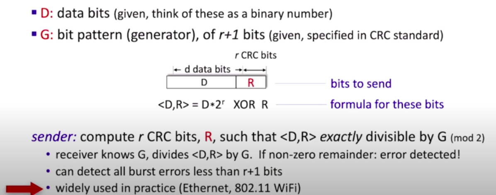
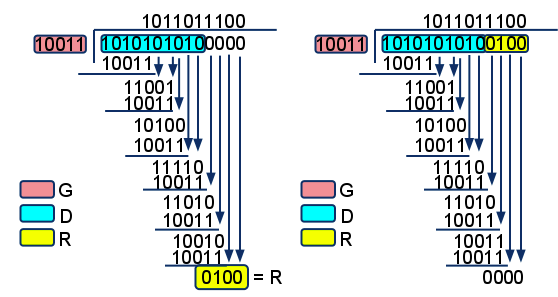
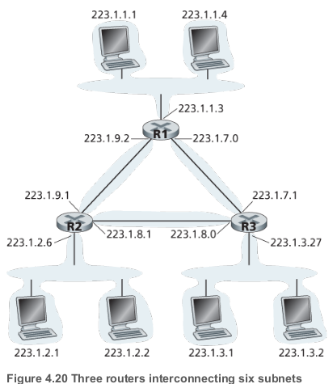
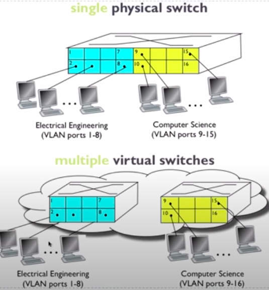

# Link layer

## Function of link layer

- **Move a datagram** from one node to an adjacent node over a single communication link
- **Framing**  - Almost all link-layer protocols encapsulate each network-layer datagram within a link-layer
  frame before transmission over the link. A frame consists of a data field, in which the network-layer
  datagram is inserted, and a number of header fields. The structure of the frame is specified by the
  link-layer protocol.
- **Link access.** A medium access control (MAC) protocol specifies the rules by which a frame is transmitted onto the link.
- **Reliable delivery.** When a link-layer protocol provides reliable delivery service, it guarantees to
  move each network-layer datagram across the link without error. A link-layer reliable delivery service is often used for links that are prone to high error rates, such as a wireless link, with the goal of correcting an error locally—on the link where the error occurs—rather than forcing an end-to-end retransmission of the data by a transport- or application-layer protocol. However, link-layer reliable delivery can be considered an unnecessary overhead for low bit-error links, including fiber, coax, and many twisted-pair copper links. For this reason, many wired link-layer protocols do not provide a reliable delivery service.
- **Error detection and correction** - The link-layer hardware in a receiving node can incorrectly decide
  that a bit in a frame is zero when it was transmitted as a one, and vice versa

## Slotted Aloha vs pure Aloha. Which one has a better efficiency?

## Broadcast channels vs Point-to-point communication link

- Two fundamentally different types of link-layer channels

| Broadcast channels               | Point-to-point                                               |
| -------------------------------- | ------------------------------------------------------------ |
| Connect multiple hosts           | Two hosts                                                    |
| Wireless LANs, satellite network | Between two routers connected by long-distance link / Between a user's office computer and the nearby Ethernet switch |
| Need for Medium Access protocol  | Point-to-point Protocol(PPP)                                 |

## Parity checking

- Simplest form of error detection

## CRC

- Cyclic Redundancy Check
- More powerful error-detection coding

## Error detection vs error correction

Error detection is determining whether the data was corrupted since it left the source; error correction goes beyond detection to determine exactly how the data was corrupted and restore it. Both error detection and error correction require some amount of redundant data to be sent with the actual data; correction requires more than detection.

[Error detection vs error correction](https://www.quora.com/What-is-the-difference-between-error-correction-and-detection)

## NIC

Network interface card

## ARP

- Kind of helper protocol for Ethernet
- "Like DNS", but maps instead IP addresses to MACs
- The frame containing the ARP query is received by **all the other adapters on the subnet**
- ARP Table stored on each host and router: 

| IP Address  | MAC Address       | TTL  |
| ----------- | ----------------- | ---- |
| 192.168.1.1 | F1-A3-C1-11-44-42 | 360  |
| ...         | ...               | ..   |

[Animation of ARP](http://cisco.num.edu.mn/CCNA_R&S1/course/module5/5.2.1.2/5.2.1.2.html#:~:text=The%20ARP%20table%20is%20stored,address%20with%20a%20MAC%20address.)

## MAC

- Multiple access channel

## 3 MAC protocols

- "taking turn"
- random access
- channel partitioning

## Polling

- Where centralized device pulls client devices to see if those client devices have ata that they want to send 
- Protocol needed for client devices to join/leave network
- Alternative: token passing

## Round robin

## IP address vs MAC address

| IP address                                         | MAC Address                                                  |
| -------------------------------------------------- | ------------------------------------------------------------ |
| Internet Protocol address                          | A media access control *address*                             |
| 32-bit                                             | 48-bit                                                       |
| Network-layer                                      | Link-Layer                                                   |
| Hierarchal(not portable)                           | Flat(portable)                                               |
| Street address                                     | SSN                                                          |
| Used to route datagrams from one subnet to another | To get a frame from one interface to another on the same network |

## Ethernet

Dominant link layer protocol

- Also includes 8 Bytes **preamble** in order to sycnhronize clocks
	- 7 x 10101010
	- 10101011
- Connectionless
	- No handshaking
- Unreliable
	- No ACKs or NACKs

- **Type** is The higher Layer protocol (e.g. IP). It's the glues that binds link layer and network layer.

## Is Ethernet reliable?

## Router vs Switches

| Routers                               | Switches                                 |
| ------------------------------------- | ---------------------------------------- |
| Allows for connection between network | Creates networks                         |
| Store-and-forward                     | Store-and-forward                        |
| Network layer                         | Link Layer                               |
| Routing tables                        | Switch Table                             |
| Routing algorithms                    | Filtering, Learning Algorithms(flooding) |

## Pros and cons of routers and switches

## Switch tables (contents of switch table)

## Bus topology vs star topology

## Subnets vs VLANs

- Both deal with segmenting or partitioning a portion of the network

| Subnets                                                      | VLANs                                                        |
| ------------------------------------------------------------ | ------------------------------------------------------------ |
| Network layer                                                | Link layer                                                   |
| An IP address can be logically split (a.k.a. subnetting) into two parts: a network/routing prefix and a host identifier. Network devices that belong to a subnet share a common network/routing **prefix in their IP address.** | Separating ports by VLAN groups separates their traffic in a similar fashion to connecting the devices to a separate, distinct switch of their own                                                                                                                                                                                                                                                                                                                                                                                                     ...................................................................................................... |
| To determine the subnets, detach each interface from its host or router, creating islands of isolated networks, with interfaces terminating the end points of the isolated networks. Each of these isolated networks is called a subnet. |                                                              |
|                                          |                                            |
| The network prefix is determined by applying a bitwise AND operation between the IP address and **subnet mask** (typically 255.255.255.0). Using an example address of 192.168.5.130, the network prefix (subnet) is 192.168.5.0, while the host identifier is 0.0.0.130. | **Traffic Isolation**   **Dynamic Membership**   **Forwarding** done via routing   **Span multiple switches** via trunk port.  802.1 Q frame |

[VLANs vs Subnets](https://blog.biamp.com/the-difference-between-vlans-and-subnets/)

## Plug and play
Something gets done automatically. E.g. it doesn't have to be configured by a system administrator. 

## What is VLAN trunking?

