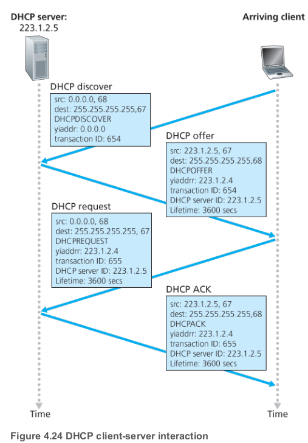
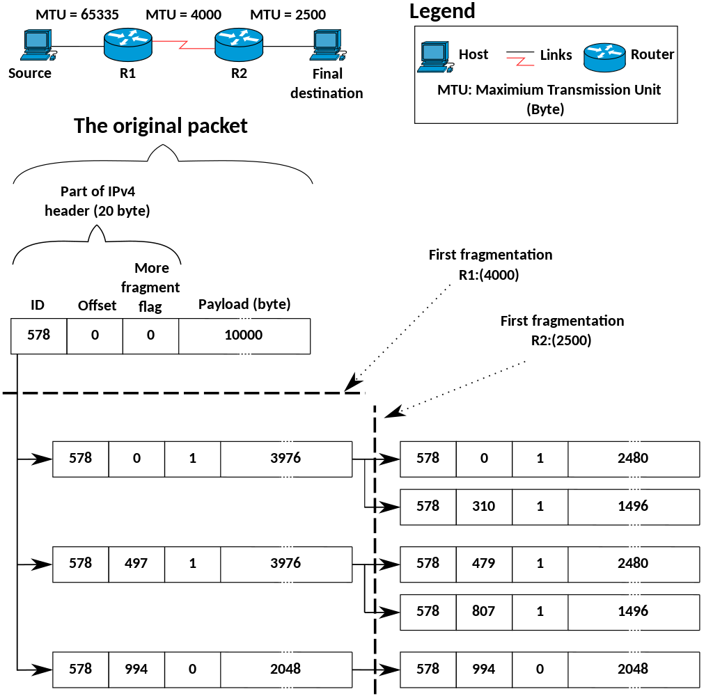
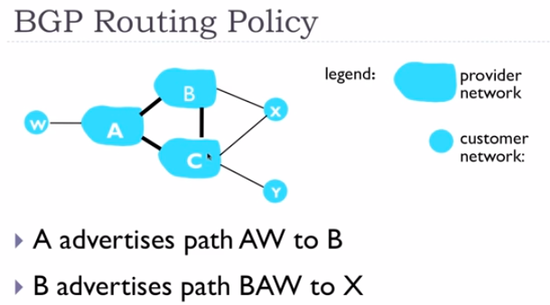
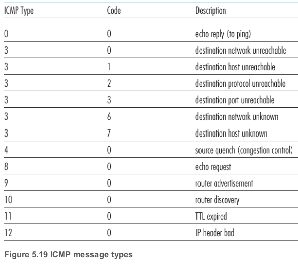
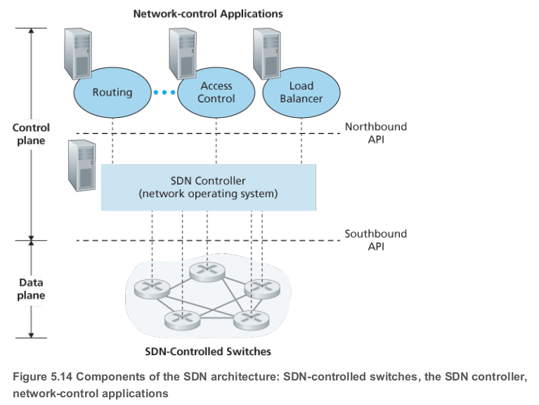
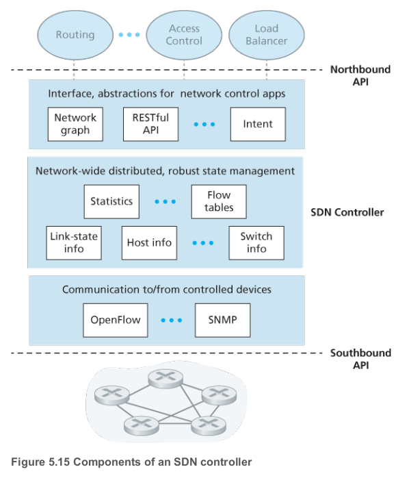
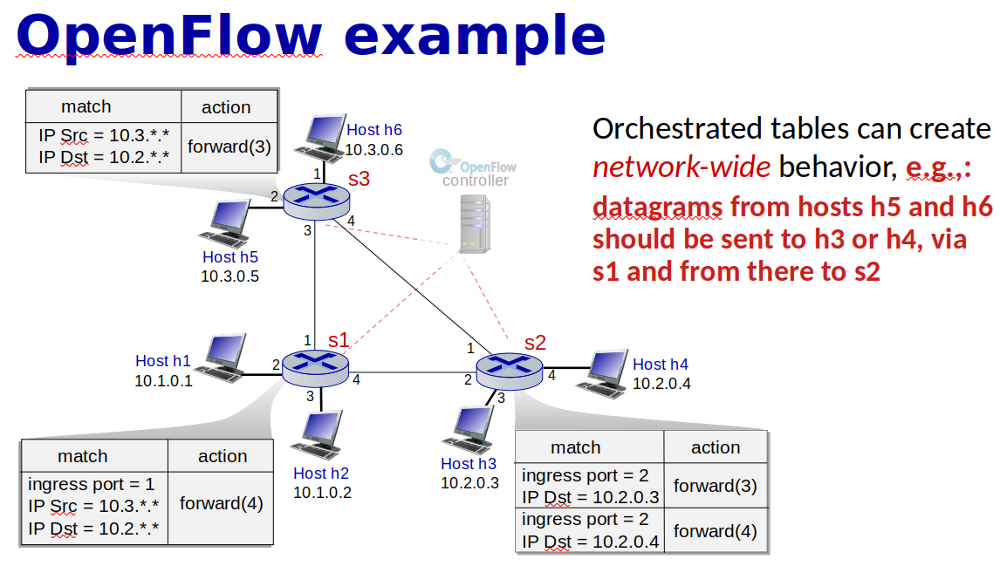

# Network layer 

## 2 main functions of network layer

|                | Forwarding                                                   | Routing                                                      |
| -------------- | ------------------------------------------------------------ | ------------------------------------------------------------ |
| Range          | Local. Moving packet from input to an appropriate output port | Global. Moving a packet over multiple different routers and hubs |
| Analogy        | Getting trough the single interchange                        | Planning a trip from CPH to Paris                            |
| Implementation | Hardware                                                     | Software                                                     |
| Duration       | Nanoseconds                                                  | Seconds                                                      |

### Router Forwarding table(aka flow table)
- To identify the outgoing link interface for a arrived packet. 
- Examine packet header and send to appropriate outgoing link
- Created be routing algorithm. Local decision to support global goals

## DHCP 

- **Dynamic Host Configuration Protocol** allows a host to obtain an IP address automatically
- How does a host get an IP address?
  - Manually - hard coded
  - Automagically-  DHCP
- Goal
  - 
  - **Dynamically Obtain IP Address**
  - Default Gateway (first hop router)
  - DNS Server 
  - Subnet Mask

### Dora

- Discover message
  - Client say I need a IP address.  Send a message to everyone 
  - UDP port 67
  - Broadcast at a link level

- Offer message
  - DHCP server will answer with offer, which contains the transaction ID of the received discover message, the proposed IP address for the client, the network mask and an IP address lease time
  - `yiaddr` - as in "your Internet address"

- Request message
  - Choose one DHCP server and respond with echoing back the configuration parameters

- ACK message
  - Confirm the requested parameters

*

- 
- All four steps are needed to confirm DHCP server that the client will use that ip, because   multiple DHCP servers are possible. 

## DNS vs DHCP

|                       | DNS                                                          | **DHCP**                                                     |
| --------------------- | ------------------------------------------------------------ | ------------------------------------------------------------ |
| **Purpose**           | DNS is usually used for resolving domains                    | DHCP is used for assigning IP’s to the host                  |
| **Features**          | It translates the written names of domains to the IP addresses | DHCP provides the IP addresses of the router, host, name server, and the subnet mask of the computer |
| **Purpose**           | You can use DNS for locating or finding the Active Directory domain servers | DHCP can provide IP to host for some limited time            |
| **Port that it uses** | DNS uses port 53                                             | DHCP uses port 67 and 68                                     |
| **Method of working** | DNS works in a decentralized manner                          | DHCP works in a centralized manner                           |
| **Benefit**           | DNS eliminates the need to keep in mind or remember all the IP addresses | DHCP is a very reliable method of assigning IP addresses     |

## What does router consist of ?

- **Input ports**
	- "ports" refering to the physical input and output router interface.
	- Here the forwarding table is consulted to determine the router output port to which an arriving packet will be forwarded via the switching fabric
- **Switching fabric**
	- connects the router's input ports to its output ports
	- Where forwarding happens
- **Outout ports**
	- stores packets received from the swirching fabric and transmits these packets on the outgoing link
	- Buffering. scheduling
- **Router processing**
	- Brains, operations 
	- Perform control plane functions
	- In SDN routers, the routing processor is responsible for communicating with the remote controller in order to receive forwarding table entries computed by the remote controller

## Switching fabric

- The main function of a switch fabric is to relay data efficiently and rapidly from its inputs to its outputs

### Memory based switching fabric vs Shared bus vs crossbar 

| Memory based                     | Shared bus               | Crossbar                                                     |
| -------------------------------- | ------------------------ | ------------------------------------------------------------ |
| Copy in memory and out of memory | Directly over a bus,     | Consist of 2N buses, capable of forwarding multiple packets in parallel |
| Old-school, slow                 | limited by bus bandwidth | Complicated, Costly, Fast                                    |

## IP
- Ip address one for interface, that's 32-bit identifier for interface . So IP isn't numbering computers/hosts, but network interfaces. Or more specific the ip address is divided between the network address and a interface address

### Private address space

| RFC1918 name |       IP address range        | Number of addresses | Largest [CIDR](https://en.wikipedia.org/wiki/Classless_Inter-Domain_Routing) block (subnet mask) | Host ID size | Mask bits | *[Classful](https://en.wikipedia.org/wiki/Classful_network)* description[[Note 1\]](https://en.wikipedia.org/wiki/Private_network#cite_note-4) |
| :----------: | :---------------------------: | :-----------------: | :----------------------------------------------------------: | :----------: | :-------: | :----------------------------------------------------------: |
| 24-bit block |   10.0.0.0 – 10.255.255.255   |      16777216       |                    10.0.0.0/8 (255.0.0.0)                    |   24 bits    |  8 bits   |                    single class A network                    |
| 20-bit block |  172.16.0.0 – 172.31.255.255  |       1048576       |                 172.16.0.0/12 (255.240.0.0)                  |   20 bits    |  12 bits  |                16 contiguous class B networks                |
| 16-bit block | 192.168.0.0 – 192.168.255.255 |        65536        |                 192.168.0.0/16 (255.255.0.0)                 |   16 bits    |  16 bits  |                            256 co                            |

[Private network Wiki](https://en.wikipedia.org/wiki/Private_network)

## What is CIDR? What does x mean in the ip address  a.b.c.d/x 

- Classless InterDomain Routering
-  is a method for allocating IP addresses and for IP routing.  [CIDR](https://en.wikipedia.org/wiki/Classless_Inter-Domain_Routing#:~:text=Carl%2DHerbert%20Rokitansky.-,CIDR%20notation,bits%20in%20the%20network%20mask.)
  - *CIDR* notation is a compact representation of an IP address and its associated *network mask*.
  - subnet (logical subdivision of an IP network) portion of address of arbitrary length. Not only limited by 8bit boundaries
- network part of address is defined in x-bits. That's **x** = # bits in subnet portion
- solves a problem if you have more than 255 computers in a network by adding `/23

### Subnet mask

- Subnet mask is another way defining `/24`
-  the subnet mask separates the IP address into the network and host addresses
- All 1's defines the network part

|   Binary form   |         Dot-decimal notation          |               |
| :-------------: | :-----------------------------------: | ------------- |
|   IP address    | `11000000.00000000.00000010.10000010` | 192.0.2.130   |
|   Subnet mask   | `11111111.11111111.11111111.00000000` | 255.255.255.0 |
| Network prefix  | `11000000.00000000.00000010.00000000` | 192.0.2.0     |
| Host identifier | `00000000.00000000.00000000.10000010` | 0.0.0.130     |

[Calculate IP ranges subnet mask](https://www.calculator.net/ip-subnet-calculator.html?cclass=any&csubnet=30&cip=212.237.182.244&ctype=ipv4&printit=0&x=100&y=27)

##  List 2 ways used to extend the usage of IPv4 

### NAT 

- Network Address Translation
- **Use 1 global IP per LAN** instead of having every public IP address for every computer
- Port identifies from which host is coming.

### IPv6

- Initial Motivation
  - Address Space

| IPv4                         | IPv6                                           |
| ---------------------------- | ---------------------------------------------- |
| 32-bit                       | 128-bit                                        |
| Optional section in a header | Fixed header. Option could be added in payload |
| Fragmentation is allowed     | No Fragmentation                               |
| Checksum                     | No checksum                                    |
|                              | Flows and Priority for better service          |

## What is fragmentation?

- Take one big dataframe and make it to a number of smaller datagrams

- Flag an fragment offset in iP header are used to identify fragment and reassemble them

- $$
  \text{Offset}=\frac{\text{Number of bytes}}{8}
  $$

*

## Routing algorithms

### Centralized vs Decentralized

|                    | Centralized/Global                        | Decentralized                     |
| ------------------ | ----------------------------------------- | --------------------------------- |
| Protocol           | Link-state                                | Distance-vector                   |
| Algorithm          | Dijkstra                                  | Bellman-Ford                      |
| Principle          | Use global information about the network. | Iterative and distributed manner  |
| Input              | All nodes and all link cost.              | Only costs and DVs from neighbors |
| Info. sharing type | Broadcast                                 | Exchange                          |
| Control plane      | Per router / Logically centralized        | Per router                        |
| Convergence speed  | Faster                                    | Slower                            |
| Msg. complexity    | Smaller                                   | Larger                            |
| Robustness         | Higher                                    | Lower                             |

### Static vs Dynamic

| Static                                    | Dynamic                                                      |
| ----------------------------------------- | ------------------------------------------------------------ |
| Changes as a result of human intervention | Change the routing paths as the network traffic loads or topology changes or periodically |
|                                           | More vulnerable to problem such as routing loops and route oscillation |

### Costs
- Constant (e.g. 1)
- Bandwidth-Related
- Congestion-Related

## Dijkstra(Link State) 

### Intro

- Global Knowledge. 
  - In practice this is accomplished by having each node broadcast link-state packets to all other nodes in the network, with each link-state packet containing the identities and costs of its attached links 
- Goal
  - Find Least-Cost Paths
- Iterative
  - Locally with the same input data

### Notations

| Description                   | Notation |
| ----------------------------- | -------- |
| Link cost                     | c(x,y)   |
| Current cost to destination v | D(v)     |
| Predecessor Node on Path to v | p(v)     |
| Nodes with known path         | N'       |

## Bellman - ford(Distance Vector)

- **Iterative** - in that this process continues on until no more information is exchanged between neighbors

- **Asynchronous** - it does not require all of the nodes to operate in lockstep with each other

- **Distributed** - each node receives some information from on or more of its directly attached neighbors 

### Challenge: Count to infinity Problem

- One of the important issue in Distance Vector Routing is County of Infinity Problem.
- Counting to infinity is just another name for a routing loop.
- In distance vector routing, routing loops usually occur when an interface goes down.
- It can also occur when two routers send updates to each other at the same time.

1.  As you see in this graph, there is only one link between A and the other parts of the network.
2.  Now imagine that the link between A and B is cut.
3. At this time, B corrects its table.
4. After a specific amount of time, routers exchange their tables, and so B receives C's routing table.
5. Since C doesn't know what has happened to the link between A and B, it says that it has a link to A with the weight of 2 (1 for C to B, and 1 for B to A -- it doesn't know B has no link to A).
6. B receives this table and thinks there is a separate link between C and A, so it corrects its table and changes infinity to 3 (1 for B to C, and 2 for C to A, as C said).
7.  Once again, routers exchange their tables.
8.  When C receives B's routing table, it sees that B has changed the weight of its link to A from 1 to 3, so C updates its table and changes the weight of the link to A to 4 (1 for C to B, and 3 for B to A, as B said).
9.  This process loops until all nodes find out that the weight of link to A is infinity.

## Datagram

The Internet’s **network layer** is responsible for moving network-layer **packets** known as **datagrams** from
one host to another.

## Autonomous systems (ASs)

- Group of routers in a region

In order to solve scalability problems routers are organized into Autonomous Systems(**ASs**) with each AS consisting of a group of routers that are under the same administrative control. Routers within the same AS all run the same routing algorithm and have information about each other. 

## Why different Intra and Inter AS routing?

- Policy
  - We ant to enforce different policies on different levels of our netwroks
- Scale
  - Hierarchical routing in order to reduce the amount of updates we need to send everybody
  - Save table size
- Performance
  - In Intra performance is really important
  - In Inter maybe policy would be more important than performance

## Intra AS routing

- **Intra**- is a prefix which means within or inside one group.

- Intra autonomous system is the routing algorithm running within an AS
- Routers in the same AS have to run the same routing protocols 

### **Common Intra-AS Routing protocols/ Interior gateway protocol** 

#### RIP: Routing Information Protocol

- Distance Vector Algorithm
- Distance Metric
  - number of hops (number of subnets)
  - max = 15hops
  - Response Message (or Advertisements) - sends DV 
  - Link Failure and Recovery: No Advertisement in 180sec = You're Dead
- RIP table processing
  - route**d**
    - UDP advertisiments

#### OSPF: Open Shortest Path First

- Link state
  - Dijkstra algorithm
- Advertisements
  - Straight IP datagrams, not UDP
- Security
  - All messages authenticated
- Multiple same cost paths
- Multiple cost metrics
- Integrated multicast
  - multiple messages to multiple recipients
- Hierarchical OSPF
  - 2 level Hierarchy
  - Local Area
  - Backbone

#### EIGRP: Enhanced Interior Gateway Routing Protocol

## Inter AS routing

- **Inter**- is a prefix that means between two groups

Routers in different ASs could run on different routing protocols 

### BGP

- Routing among the ISPs

- Border Gateway Protocol
- The de facto standard
- Allows AS to
  - Obtain Subnet Reachability Information
  - Propagate Reachability Information to Internal Routers
  - Determine Good Routes to External Subnets
    - Reachability information
    - Policy
- Destinations are prefixes NOT Hosts   
- Prefix + Attributes = Route

  - Advertised prefix includes BGP attributes
  - 2 Important Attributes
    - AS-PATH - path of AS that you have to pass in order to get to this prefix
    - NEXT-HOP - IP address of the router interface that begins the AS-PATH
- Route Selection
1. Local Preferences Value Attribute: Policy Decision
  2. Shortest AS-PATH
  3. Closest NEXT-HOP router: Hot potato routing
  4. Additional criteria
- BGP Messages
  - Messages exchanged using TCP
  - Types
    - OPEN: opens TCP connection to peer and authenticate sender
    - UPDATE: advertises new path(or withdraws old)
    - KEEPALIVE: keeps connection alive in absence of UPDATES; also ACKs OPEN request
    - NOTIFICATION: reports error in previous msg, also used to close connection
    - 

### iBGP vs eBGP

- BGP Peer
  - BGP neighbors, called peers, are established by manual configuration among routers  to create a TCP session on port 179. 
- Two differenr BGP Sessions:

| iBGP                                                         | eBGP                                              |
| ------------------------------------------------------------ | ------------------------------------------------- |
| *Internal BGP*                                               | External BGP                                      |
| When BGP runs between two peers in the same [autonomous system](https://en.wikipedia.org/wiki/Autonomous_system_(Internet)) (AS) | When it runs between different autonomous systems |

### BGP Routing Policy

- B shouldn't advertise path BAW to C, because B does not want to provide service for C when C can be get through A , so any routes that can be gotten to through other means we'd prefer that, because then B wasting its bandwidth

## Gateway routers
- Router that connects ASs 
- have to use them if we have external destination 

## Hot Potato Routing

One of the simplest BGP routing algorithms

## ICMP

- **Internet control message protocol** is used by hosts and routers to communicate network layer information to each other. The most typical use of ICMP is for error reporting

## SNMP

SNMP is an application-layer protocol used to convey netwrokd-management control and information messages between a managing server and an agent executing on behalf of the managing server

## SDN

**Software-defined networking** (**SDN**) technology is an approach to network management that enables dynamic, programmatically efficient network configuration in order to improve network performance and monitoring, making it more like cloud computing than traditional network management

Key characteristics of an SDN architecture:

- **Packet forwarding can be based on any number of header fields.** 
  - Rules are specified in a switch's flow table; it is the job of the SDN control plane to compute, manage and install flow table entries in all of the network switches
- **Separation of data plane and control plane**
  - The data plane consists of the network switches- relatively simple(but fast) devices that execute the "match+action" rules in their flow tables.
  - The control plane consists of servers and software that determine and manage the switches flow table
- **Network control functions: external to data-plane switches**
  - The control plane itself consists of two components
    - **SDN controller** - maintains accurate network state information
    - **Set of network control applications** - Access control, Routing, Load balancer

- **Programmable network**
  - The network is programmable through the network control applications running in the control plane. E.g. routing with Dijkstra algorithm 

That's data plane switches, SDN controllers and network control applications are separate entities.

- A controllers functionality can be organized into three layers:

## Forwarding
Forwarding has two main operations: match and action.

## Match + action

- Match bits in arriving packet, take action

| Destination based forwarding      | Generalized forwarding                             |
| --------------------------------- | -------------------------------------------------- |
| Forward based on dest. IP address | Many headers can determine action                  |
|                                   | Many actions possible: drop/copy/modify/log packet |

## Generalized forwarding

- Replaces Decision based forwarding
- Many more fields than destination address can be consulted and much wider range of actions
- Match+action
- OpenFlow - emerging standard for generalized forwarding

|              | Simple packet handling rules                                 |
| ------------ | ------------------------------------------------------------ |
| **Match**    | Pattern values in packet header fields                       |
| **Actions**  | For matched packet: drop, forward, modify(e.g. NAT), matched packet or send matched packet to controller |
| **Priority** | Disambiguate overlapping patterns                            |
| **Counters** | #bytes and #packets                                          |

## OpenFlow

- Specific generalized  forwarding, that has been standardized
- Unifies different kinds of devices

| Device       | Match                                 | Action                   |
| ------------ | ------------------------------------- | ------------------------ |
| **Router**   | Longest destination IP prefix         | Forward out a link       |
| **Switch**   | Destination MAC address               | Forward or flood         |
| **Firewall** | IP addresses and TCP/UDP port numbers | Permit or dent           |
| **NAT**      | IP address and port                   | Rewrite address and port |

- No need for routing protocols, because forwarding tables are computes in the SDN controller

## Hop

A hop is a computer networking term that refers to the number of routers that a packet (a portion of data) passes through from its source to its destination.

[Hop](https://www.lifewire.com/what-are-hops-hop-counts-2625905#:~:text=A%20hop%20is%20a%20computer,%2C%20access%20points%2C%20and%20repeaters.)

