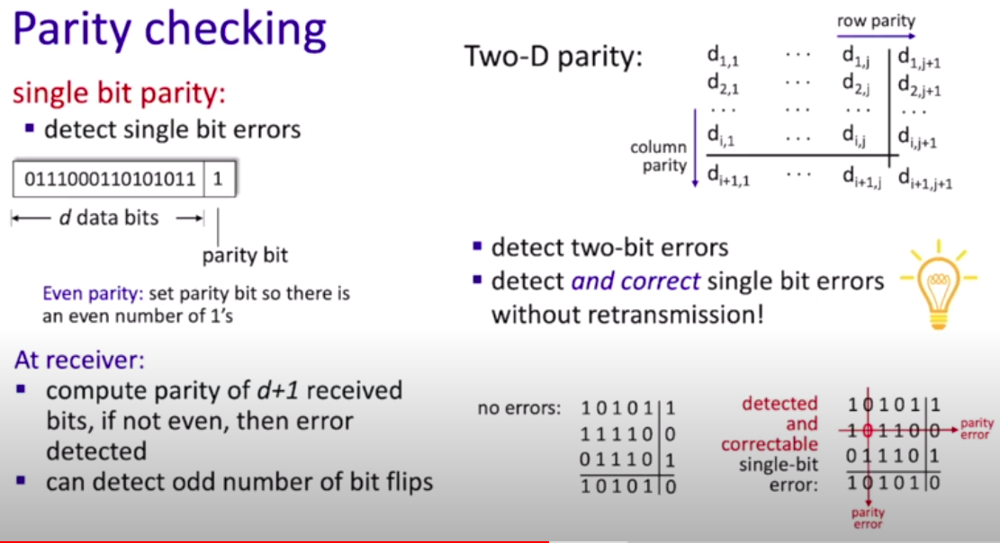
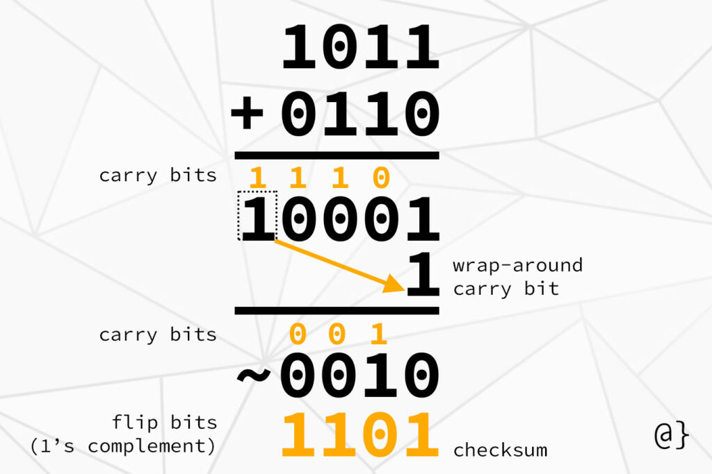
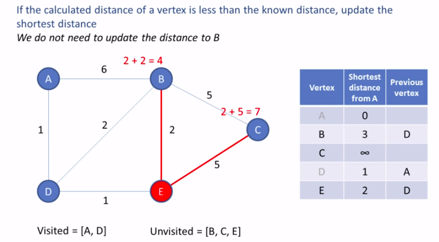
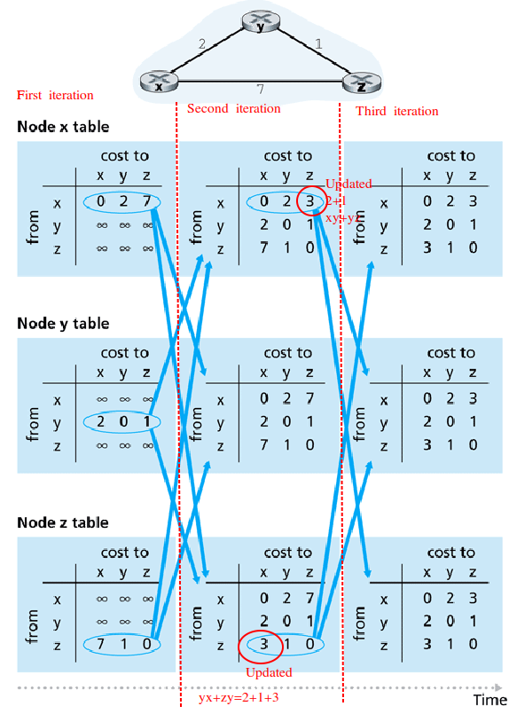
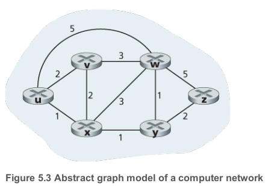
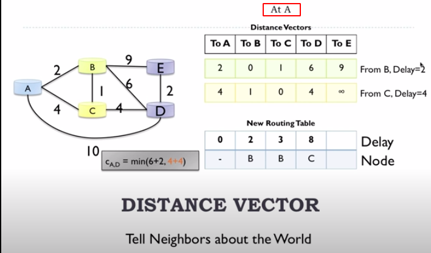
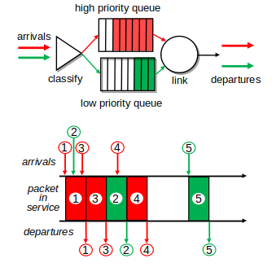
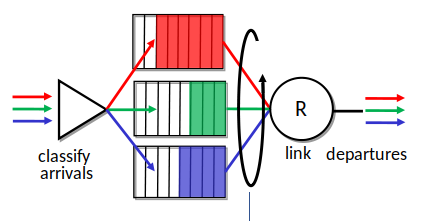
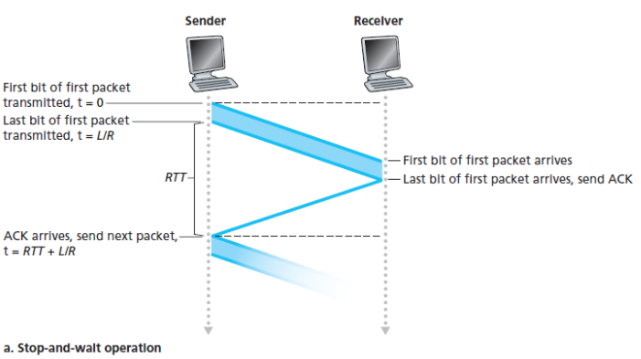
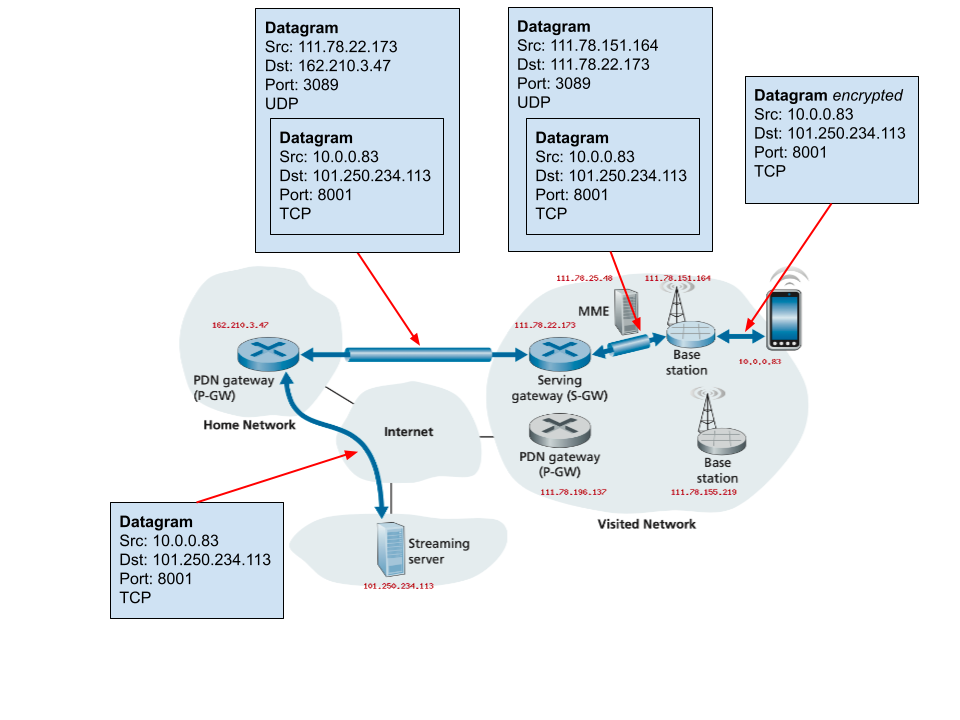

#  Practice


## Delays


| Unit              | Transfer from second |
| ----------------- | -------------------- |
| Milliseconds (ms) | *10^3                |
| Microseconds (us) | *10^6                |

### End-to-End Delay

The homogeneous delays

$$
d_{end-to-end} = N(d_{proc}+d_{trans}+d_{prop})
$$

Suppose there are N−1 routers between the source host and the destination host.

### Transmission delay

- Time to transmit packet into channel

$$
D_{trans} = \frac{L}{R}
$$

- $L$ is length of the packet in bits
- $R$ is transmission rate of the link in bits/sec

- Example: 1 Gbps link, 8000 bit packet

$$
D_{trans} = \frac{8000bit}{10^9bit/sec}= 8microsecs
$$


### Propagation delay

$$
D_{prop} = \frac{distance}{speed}
$$

Note, easiest to convert $KM$ to $m$


### Queue delay


$$
D_{queue} = I(L/R)*(1-I) \quad\text{  for  } \quad I<1 
$$
Where 

- $I=\frac{L*a}{R}$ is traffic intesity
- $L$ is constant packet-length in bits
- $a$ is the average rate of packets/seconds
- $R$ constant transmission rate 


**Packets left in buffer**
$$
\text{packets left in buffer} = \text{packets arrived} - floor(\text{time}/\text{delay}) 
$$

- Time is total time in the buffer. 
- Time and delay must be in one unit, .e.g. ms


### Nodal delay  (the delay at a single route)

> As a packet travels from one node (host or router) to the subsequent node (host or router) along this path, the packet suffers from several types of delays at *each* node along the path. The most important of these delays are the **nodal processing delay**, **queuing delay**, **transmission delay**, and **propagation delay**; together, these delays accumulate to give a **total nodal delay**.
>
> — (Kurose and Ross 2013, 35–36)

$$
d_{nodal}=d_{proc}+d_{queue}+d_{trans}+d_{prop}
$$


****

## Error detection techniques


### Parity checking

- Make it even. So if 1's is not even, so add 1, otherwise just 0
- With 2D parity, you **can detect** the presence of **two flipped bits,** but you **can't know their exact locations in order to correct them.**




### Cyclic redundancy checks(CRC)

[CRC calculator](http://www.ee.unb.ca/cgi-bin/tervo/calc.pl?num=10011110111&den=1001&f=d&e=1&m=1)

**Calculate CRC bits**

1. Take **D** the data payload and add to it at the end r*0's. 
2. Insert  the result  to A in the calculator
3. Insert **G** the generator to the B in the calculator
4. The remainder is the CRC bits


**Check at the receiver that no error occur**

1. Take **D** and add remainder to the end. That's what the receiver gets.
2. Insert the result to A in the calculator
3. Insert **G** the generator to the B in the calculator
4. If the result is 0's  so there is no errors. 


### Checksum calculation

To compute the Internet checksum of a set of 16-bit words:
1. Add the two numbers together, making sure that any carry into the 17th bit of this initial sum is added back into the 1's place of the resulting sum)
2. Take the one's complement of the result.

**Example 1. 16-bit words**

>1001001110010011
>
> 1001100001001101


1. Sum:  0010101111100001
2. Complement:  1101010000011110


**Example 2. 4-bit words**




**Example 3. 8-bit words** 
>If the data unit to be transmitted is 10101001 00111001, the following procedure is used at Sender site and Receiver site.

```
Sender Site:
10101001        subunit 1  
00111001        subunit 2        
11100010        sum (using 1s complement)       
00011101        checksum (complement of sum- that's swapping 0s and 1s)

_______________________________
Data   				| Checksum
--------------------|----------
10101001 00111001	| 00011101


Receiver Site:
10101001        subunit 1  
00111001        subunit 2     
00011101        checksum 
11111111        sum
00000000        sum's complement
```


****

## Random Access Protocols

### Effciency

#### Aloha Pure

$$
efficiency_{pure} = N*p*(1-p)²*(N-1)
$$

**Example of Pure**

Given $N=2$ active nodes and a probability of transmission $p=0.4$. What is the maximum efficiency?
$$
efficiency_{pure}= 2*0.4*(1-0.4)²*(2-1)=0.29= 29\%
$$


#### Aloha Slotted

$$
efficiency_{slotted} = N*p*(1-p)^{N-1}
$$

**Example Slotted**

Given $N=3$ active nodes and a probability of transmission $p=0.$3. What is the maximum efficiency
$$
efficiency_{slotted} =3*0.3*(1-0.3)^2 = 0.44= 44\%
$$

### Collisions

#### Slotted Aloha

Operation:

- When node obtains fresh frame, **transmits in next slot**
  - if no collision: node can send new frame in next slot
  - if collision: node retransmits frame in each subsequent slot with probability p untril success


#### Aloha

- No synchronization
- When frame first arrives: **transmit immediately**

#### CSMA

- Listen before transmit
- if channel sensed **idle**: **trasnmit entire frame** 
  - The transmission can be still interrupted and message isn't sent succesfully  , if another node tries to send before it can see that a channel is busy (there is some propagation delay, so two nodes may not hear each other just-started transmission)
- if channel sense **busy**: **defer transmission**


#### CSMA/CD

- Transmission aborted on collision detection

  - Mind, the propagration delay again. Transmission trans1 is aborted at time trans2 is sent+propragation delay. E.g. trans1 sent at 0.3, trans2 sent at 0.6, propagation 0.4, so trans1 is aborted 0.6+0.4=1.0 and trans2 is aborted at 0.7. And there is also delay to inform others about abortion.

    


****

## Routing algorithms


### How does Dijkstra Algorithm work?

- The main idea to keep the best path found until now and the reference to previous vertex.


<iframe width="820" height="600"
  src="http://courses.compute.dtu.dk/02105+02326/2020/part3/4shortestpaths/dijkstra.mp4">
</iframe>


```
Let distance of start vertex from start vertex = 0
Let distances of all other vertices from start = infinity

WHILE vertices remain unvisited
	Visit univisted vertex with smallest known distance from start vertex
	FOR EACH univisited neighbour of the current vertex
		Calculate the distance from start vertex
		IF the calculated distance of this vertex is less than the known distance
			Update shortest distance this vertex
			Update the previous vertex with the current vertex
        END IF
    Add the current vertex on the list of visited vertices
END WHILE
```





[Youtube Dijkstra algorithm](https://www.youtube.com/watch?v=pVfj6mxhdMw)


### How does Bellman - ford(Distance Vector) work?





The current node only know the distances to neighbors and the shortest paths to all other nodes from these neighbors.  By using this information and the equation below we can decide which path we should take:
$$
d_x(y) = min_v[c(x,v)+d_v(y)]
$$

| Annotation | Description                            |
| ---------- | -------------------------------------- |
| $c(x,v)$   | cost from x to v                       |
| $d_x(y)$   | cost of least-cost path from x to y    |
| $min_v$    | min is taken over all neighbors v of x |

That's, how much it will cost if I take through this node, because I know my distance to it and his distances to all other nodes.  Each neighbor see what his neighbors see. 


**B-F Equation example**



- $d_v(z)=5$
- $d_x(z)=3$
- $d_w(z)=3$
$$
d_x(y) = min_v[c(u,v)+d_v(z), c(u,x)+d_x(z), c(u,w)+d_w(z)] = \\
min_v[2+5, 1+3, 5+3] = 4
$$


**Maintains**

- $D_x=[D_x(y):y\in N]$ - Node x maintains its own distance vector
- $D_v=[D_v(y):y\in N]$ - Node x also maintains distance vectors for each neighbor v

*DV is big as nodes in the network*

**Overview**

- Send DV to Neighbors. 
- Update DV using B-F Equation
- Repeat





****
## Packet scheduling


| Method                         | Description                                                  |
| ------------------------------ | ------------------------------------------------------------ |
| **FCFS**                       | FIFO, packets trasnmitted in order of arrival to output port |
| **Priority**                   | Send packets from highest priority queue that has buffered packets <br>  |
| **Round robin**                | Sends one comple packet from each class in turn <br>  |
| **Weighted Fair Queuing(WFQ)** | each class gets weighted amount of service in each cycle <br> $\frac{W_i}{\sum_j{W_j}}$ <br>  |


****

## RTT

$$
RTT = 2*D_{prop}
$$



### Estimate RTT
$$
\text{EstimatedRTT}_n=(1-\alpha)*\text{EstimatedRTT}_{n-1}+\alpha*\text{SampleRTT}_n
$$
Recommended value for $\alpha$ is 0.125

### Variability of the RTT
$$
\text{DevRTT}_n=(1-\beta)* \text{DevRTT}_{n-1} + \beta * |\text{SampleRTT}_n - \text{EstimatedRTT}_{n-1}|
$$
Recommended value for $\beta$ is 0.25

### Timeout
$$
\text{TimeoutInterval}_n=\text{EstimatedRTT}_n+4*\text{DevRTT}_n
$$


**Example**

> Suppose that TCP's current estimated values for the round trip time (*estimatedRTT*) and deviation in the  RTT (*DevRTT*) are 340 msec and 28 msec, respectively (see Section 3.5.3 for a discussion of these variables). Suppose that the next three measured values of the RTT are 200 msec, 220 msec, and 300 msec respectively. Compute TCP's new value of *DevRTT, estimatedRTT,* and the TCP timeout value after each of these three measured RTT values is obtained. Use the values of α = 0.125, and β = 0.25. Round your answers to two decimal places after leading zeros.

Given:
$$
\text{EstimatedRTT}_0 = 340msec
$$

$$
\text{DevRTT}_0 = 28msec
$$

$$
\text{SampleRTT}_1 = 200msec \\
$$

$$
\text{SampleRTT}_2 = 220msec \\
$$

$$
\text{SampleRTT}_3 = 300msec \\
$$

$$
\alpha=0.125 \\ 
$$

$$
\beta=0.25
$$
- What is the estimated RTT after the first RTT?
$$
\text{EstimatedRTT}_1=(1-0.125)*340+0.125*200 = 322.5
$$
- What is the RTT Deviation for the first RTT?
$$
\text{DevRTT}_1=(1-0.25)* 28 + 0.25*|340 - 200| = 56
$$
- What is the TCP timeout for the first RTT?
$$
\text{TimeoutInterval}_1=\text{EstimatedRTT}_1+4*\text{DevRTT}_1 = 322.5+4*  56 = 546.5
$$
- What is the estimatedRTT after the second RTT?
$$
\text{EstimatedRTT}_2=(1-0.125)*322.5+0.125*220 = 309.69
$$
-  What is the RTT Deviation for the the second RTT?
$$
\text{DevRTT}_2=(1-0.25)* \text{DevRTT}_{1} + \beta * |\text{SampleRTT}_2 - \text{EstimatedRTT}_{1}|
$$

$$
\text{DevRTT}_2=(1-0.25)* 56 + 0.25 * |220 -322.5| = 67.63
$$
- What is the TCP timeout for the second RTT?
$$
\text{TimeoutInterval}_2=\text{EstimatedRTT}_2+4*\text{DevRTT}_2 = 309.69+4*67.63 = 580.21
$$
- What is the estimatedRTT after the third RTT?
$$
\text{EstimatedRTT}_3=(1-\alpha)*\text{EstimatedRTT}_{3-1}+\alpha*\text{SampleRTT}_3
$$

$$
\text{EstimatedRTT}_3=(1-0.125)*309.69+0.125*300 = 308.48
$$
- What is the RTT Deviation for the the third RTT?
$$
\text{DevRTT}_3=(1-\beta)* \text{DevRTT}_{3-1} + \beta * |\text{SampleRTT}_3 - \text{EstimatedRTT}_{3-1}|
$$

$$
\text{DevRTT}_3=(1-0.25)* 67.63 + 0.25 * |300 - 309.69| = 53.14
$$
- What is the TCP timeout for the third RTT?
$$
\text{TimeoutInterval}_3=\text{EstimatedRTT}_3+4*\text{DevRTT}_3 =  308.48 + 4*53.14 = 521.04
$$

## Traceroute
- Each hop represented  by a different line
- TTL how long a packet can live before it discarded. 
- `* * *` means that the router at that hop doesn't respond to the packet. 
- First column the number of hop.
- Second column destination address.   
- Traceroute will actually send three packets of data, and measure the time taken for each - this is shown in the 3 columns after the destination

### eb.dk
```
(base) arm@arm-DELL:~$ traceroute www.eb.dk
traceroute to www.eb.dk (91.214.22.65), 30 hops max, 60 byte packets
 1  _gateway (192.168.43.30)  156.456 ms  156.360 ms  156.414 ms
 2  * * *
 3  10.117.2.172 (10.117.2.172)  158.470 ms  158.430 ms  158.389 ms
 4  10.219.160.20 (10.219.160.20)  158.348 ms * *
 5  195-215-224-90-static.dk.customer.tdc.net (195.215.224.90)  301.828 ms  301.788 ms  301.747 ms
 6  ae1-0.alb2nqp8.dk.ip.tdc.net (83.88.19.119)  301.709 ms  655.345 ms  655.230 ms
 7  ae-6.edge2.Copenhagen2.Level3.net (4.68.72.193)  655.235 ms  654.950 ms  654.968 ms
 8  213.242.108.194 (213.242.108.194)  654.853 ms  654.814 ms  654.772 ms
 9  et-3-3-0-0.taas11cr1dk.gc-net.eu (77.243.32.202)  654.732 ms  654.691 ms  654.724 ms
10  212-98-126-214.hoer1cr1dk.gc-net.eu (212.98.126.214)  129.530 ms  129.451 ms  129.414 ms
11  * * *
12  * * *
13  * * *
...
```

### princeton.edu
```
(base) arm@arm-DELL:~$ traceroute www.princeton.edu
traceroute to www.princeton.edu (104.18.5.101), 30 hops max, 60 byte packets
 1  _gateway (192.168.43.206)  7.518 ms  7.757 ms  7.844 ms
 2  * * *
 3  10.117.2.172 (10.117.2.172)  155.456 ms  155.414 ms  155.363 ms
 4  10.219.160.20 (10.219.160.20)  155.313 ms  155.263 ms  155.213 ms
 5  irb-610.alb2tdm13nqe2.dk.ip.tdc.net (195.215.224.90)  155.173 ms  155.150 ms  155.091 ms
 6  ae0-0.alb2nqp8.dk.ip.tdc.net (83.88.19.117)  155.069 ms  18.168 ms  22.646 ms
 7  peer-as13335.alb2nqp8.dk.ip.tdc.net (128.76.59.91)  942.923 ms  943.039 ms  943.030 ms
 8  104.18.5.101 (104.18.5.101)  942.894 ms  942.884 ms  942.875 ms
(base) arm@arm-DELL:~$ 

```


## Utilization - fraction of time sender busy sending

- In relation to the performance of RTT
$$
U_{sender}=\frac{D_{trans}}{RTT+D_{Trans}}
$$
- Example: 
$$
D_{trans}=8mircosecs \\
RTT = 30 ms \\
U_{sender} = \frac{0.008}{30+0.008} = 0.00027
$$


## 4G wireless tunneling


