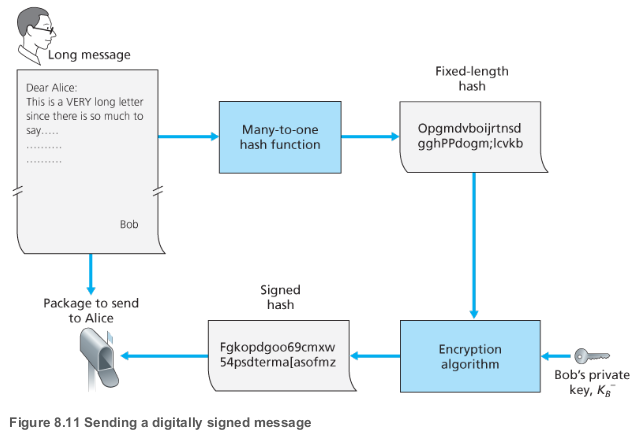
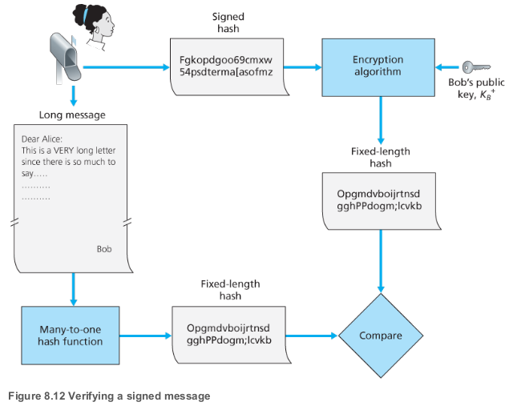
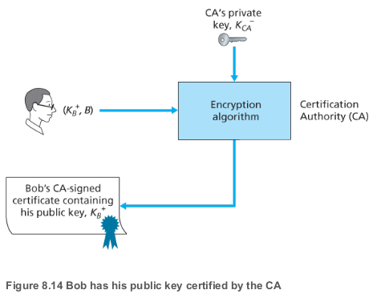
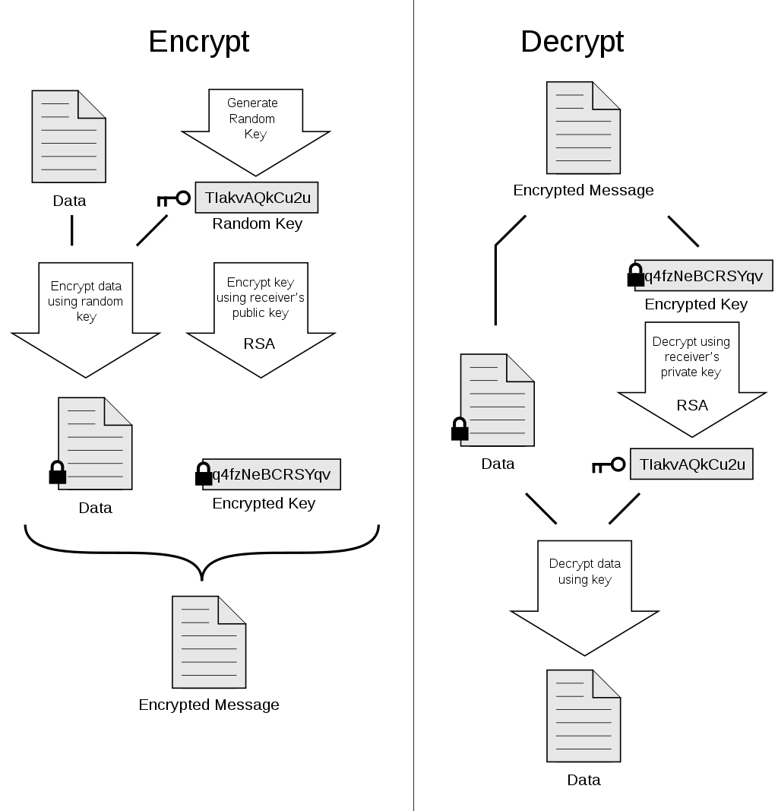
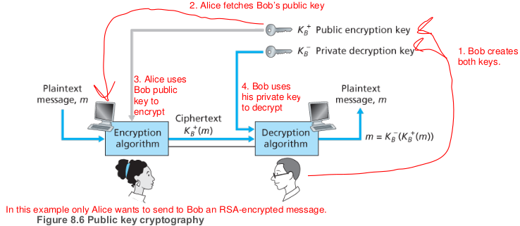
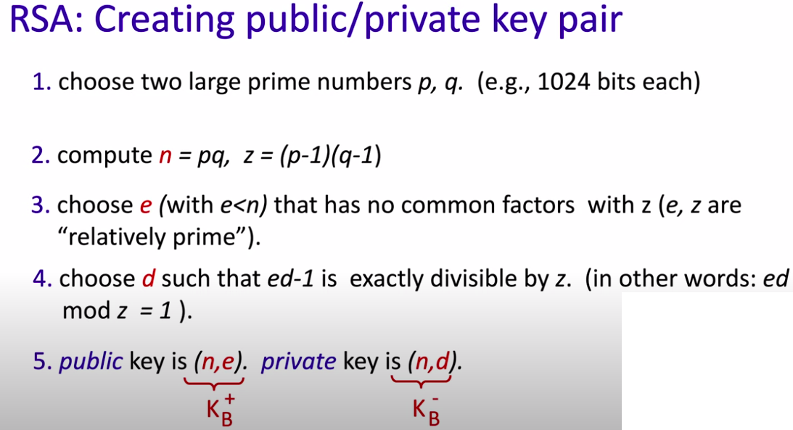
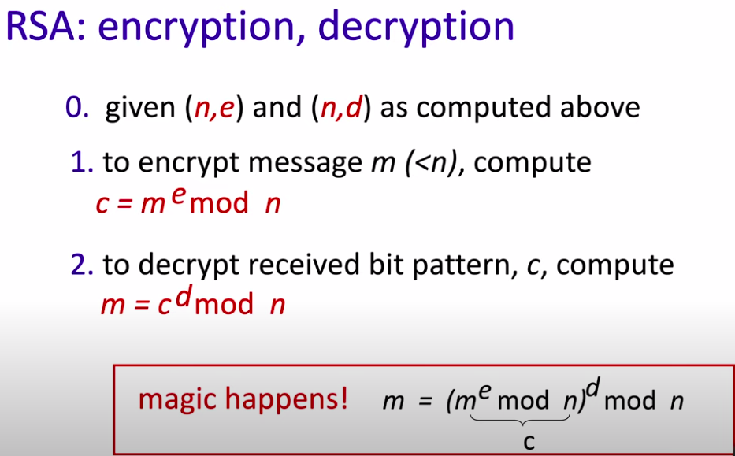
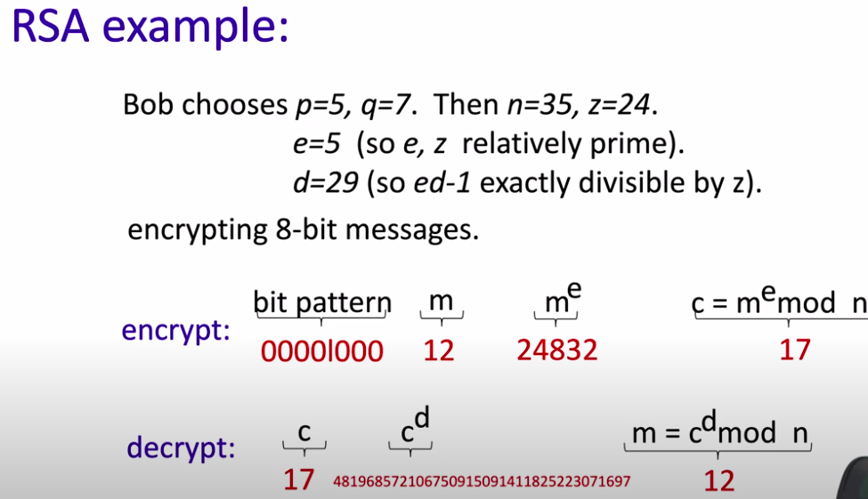

# Network security

## Types of security

| Type                        | Description                                                  |
| --------------------------- | ------------------------------------------------------------ |
| **Message Integrity**       | Ensure message not altered (in transit, or afterwards) without detection |
| **Confidentiality**         | Only sender, intended receiver should “understand” message contents. sender encrypts message. receiver decrypts message |
| **Authentication**          | Sender, receiver want to confirm identity of each other      |
| **Access and availability** | Services must be accessible and available to users           |

## Chiper

A cipher is a method for encrypting data 

## Digital Signatures

- To indicate the owner of the document, or to signify one's agreement with a documents content
- Must be verifiable and nonforgeable.

- 
- Example: RSA

https://www.youtube.com/watch?v=2vKQ3DwHi4w&list=PLVEo1P9gAninM7KwP1KKolfMQdNs6P6Am&index=69

## Certification Authorities

- **Challenge** with digital signatures is how to verify  that a receiver have the actual public key of the enitity with whom you want to communicate. For example, when Alice wants to communicate with Bob using public key cryptography, she needs to verify that the public key that is supposed to be Bob’s is indeed Bob’s.
- Binding a public key to a particular entity is typically done by a Certification Authority(CA), whose job is to validate identities and issue certificates:
  1. A CA verifies that an entity is who it says it is
  2. Once the CA verifies the identity of the entity, the CA creates a certificate that binds the public key of the entity to the identity.  The certificate contains the public key and globally unique identifying information about the owner of the public key (for example, a human name or an IP address). The certificate is digitally signed by the CA.

https://www.geeksforgeeks.org/digital-signatures-certificates/

## Firewall vs IDS (To-Do)

| PARAMETER                                | FIREWALL                                                     | IDS                                                          |
| :--------------------------------------- | :----------------------------------------------------------- | :----------------------------------------------------------- |
| Abbreviation for                         | -                                                            | Intrusion Detection System                                   |
| Philosophy                               | Firewall is a network security device that filters incoming and outgoing network traffic based on predetermined rules | An intrusion detection system (IDS) is a device or software application that monitors a traffic for malicious activity or policy violations and sends alert on detection. |
| Principle of working                     | Filters traffic based on IP address and port numbers         | Detects real time traffic and looks for traffic patterns or signatures of attack and them generates alerts |
| Configuration mode                       | Layer 3 mode or transparent mode                             | Inline or as end host (via span) for monitoring and detection |
| Placement                                | Inline at the Perimeter of Network                           | Non-Inline through port span (or via tap)                    |
| Traffic patterns                         | Not analyzed                                                 | Analyzed                                                     |
| Placement wrt each other                 | Should be 1st Line of defense                                | Should be placed after firewall                              |
| Action on unauthorized traffic detection | Block the traffic                                            | Alerts/alarms on detection of anomaly                        |
| Related terminologies                    | > Stateful packet filtering > permits and blocks traffic by port/protocol rules | > Anomaly based detection > Signature detection > Zero day attacks > Monitoring > Alarm |

[Firewall vs IDS](https://ipwithease.com/firewall-vs-ips-vs-ids/)

## Pretty Good Privacy ( PGP )  

- PGP is an encryption program that provides cryptographic privacy and authentication for data communication. PGP is used for signing, encrypting, and decrypting texts, e-mails, files, directories, and whole disk partitions and to increase the security of e-mail communications. 

- Depending on the version, the PGP software uses MD5 or SHA for calculating the message digest; CAST, triple-DES, or IDEA for symmetric key encryption; and RSA for the public key encryption.

- Providing also a mechanism for public key certification

[PGP](https://en.wikipedia.org/wiki/Pretty_Good_Privacy)

## Symmetric key vs Public private key (asymmetric) encryption

| **Symmetric Key Encryption**                                 | **Asymmetric Key Encryption**                                |
| :----------------------------------------------------------- | :----------------------------------------------------------- |
| It only requires a single key for both encryption and decryption. | It requires two key one to encrypt and the other one to decrypt. |
| The size of cipher text is same or smaller than the original plain text. | The size of cipher text is same or larger than the original plain text. |
| The encryption process is very fast.                         | The encryption process is slow.                              |
| It is used when a large amount of data is required to transfer. | It is used to transfer small amount of data.                 |
| It only provides confidentiality.                            | It provides confidentiality, authenticity and non-repudiation. |
| Examples: 3DES, AES, DES and RC4                             | Examples: Diffie-Hellman, ECC, El Gamal, DSA and RSA         |
| In symmetric key encryption, resource utilization is low as compared to asymmetric key encryption. | In asymmetric key encryption, resource utilization is high.  |

[Symmetric vs asymetric](https://www.geeksforgeeks.org/difference-between-symmetric-and-asymmetric-key-encryption/)

### 3DES(Symmetric)

Triple Data Encryption Algorithm (TDEA or Triple DEA), is a symmetric-key block cipher, which applies the DES cipher algorithm three times to each data block.

### RSA(Public-private)

