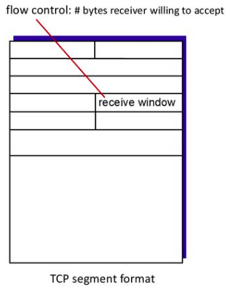
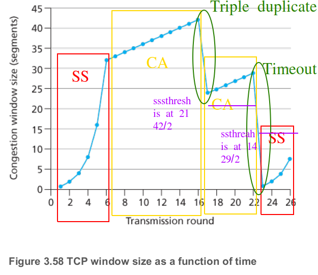
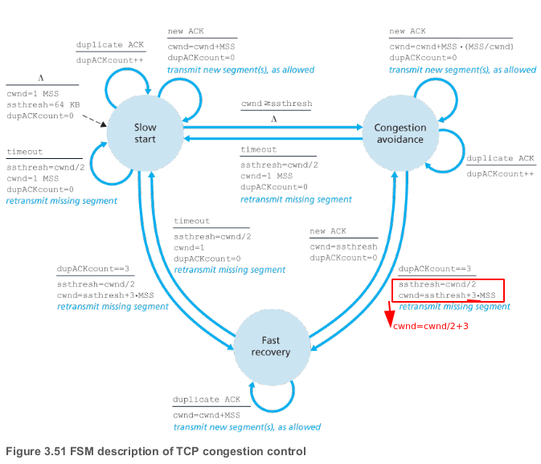
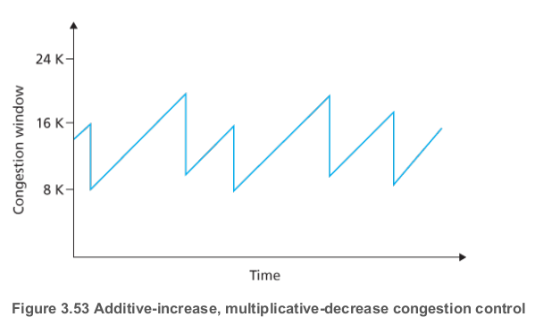
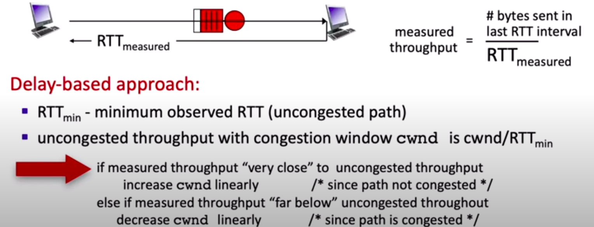

# Transport layer 

## Bit error

Send 1 and received 0, but all packet are still delivered

## Sockets

- Doors through which data passes from the network to the process and through which data passes from the process to the network. 
- sockets are the only one API that sits between application layer and transport layer
- **TCP sockets**
	- when contacted by client, server TCP **creates new socket** for server process to communicate with that particular client for the duration of that TCP connection
	- allows server to talk with multiple client
	- source port numbers used to distinguish clients 

## TCP

- TCP (Transmission Control Protocol) is a Transport Layer host-to-host protocol for **connection-oriented communication** between two computers on an IP network. TCP uses virtual ports to create a virtual end-to-end connection that can reuse the physical connections between two computers. TCP encapsulates higher level protocol data such as HTTP and, SMTP (email). [TCP](https://developer.mozilla.org/en-US/docs/Glossary/Transmission_Control_Protocol_(TCP))  

- It is specifically designed as a model to offer highly reliable and end-to-end byte stream over an unreliable internetwork. [TCP ](https://www.guru99.com/tcp-vs-udp-understanding-the-difference.html) 

### TCP Handshake
The TCP three-way handshake, also called the TCP-handshake, three message handshake, and/or SYN-SYN-ACK, is the method used by TCP to set up a TCP/IP connection over an IP-based network. The three messages transmitted by TCP to negotiate and start a TCP session are nicknamed SYN, SYN-ACK, ACK for SYNchronize, SYNchronize-ACKnowledgement, and ACKnowledge. The three message mechanism is designed for the two computers that want to pass information back and forth and can negotiate the parameters of the connection before transmitting data such as HTTP browser requests.  [TCP Handshake](https://developer.mozilla.org/en-US/docs/Glossary/Transmission_Control_Protocol_(TCP))

### TCP Fast Retransmit
- If sender receives 3 ACKs for same data ("triple dublicate ACKs"), resend unACKed segment with smallest seq #
- likely that unACKed segment lost, so don't wait for timeout.

### TCP Flow control

- Send will not overwhlem receiver
- TCP provides flow control by having the sender maintain a variable called the receive window , denoted `rwnd`

### TCP congestion control

| Phase                    | When                                                         | How `cwnd` increases     |
| ------------------------ | ------------------------------------------------------------ | ------------------------ |
| **Slow start**           | From start/Timeout occurred                                  | Increasing exponentially |
| **Congestion avoidance** | `cwnd>=sstresh`/Triple duplicate occurred and recovered from Fast recovery with ACK | Increasing linearly      |
| **Fast recovery**        | Triple duplicate occurred                                    | Increasing linearly      |

[Fast recovery in Stackoverflow](https://stackoverflow.com/questions/30818925/tcp-congestion-control-fast-recovery-in-graph)

- Slow start

-  Additive-increase, multiplicative-decrease (AIMD)

- TCP CUBIC
- Delay-based congestion control.
	- Note that currently measured throughput is never greater than `cwnd/RTTmin`
	- If  currently measured throughput is equal or a bit less than `cwnd/RTTmin` increase the sending rate
	- If currently measured thourghput is much less that  `cwnd/RTTmin` decrease the sending rate   
	

- Explicit congestion notification

  

`cwnd` - congestion window

`ssthresh` - when congestion control hits the value, it start to increase linearly

## UDP

The User Datagram Protocol (UDP) is simplest Transport Layer communication protocol available of the TCP/IP protocol suite. It involves minimum amount of communication mechanism. UDP is said to be an unreliable transport protocol but it uses IP services which provides best effort delivery mechanism.

In UDP, the receiver does not generate an acknowledgement of packet received and in turn, the sender does not wait for any acknowledgement of packet sent. This shortcoming makes this protocol unreliable as well as easier on processing. [UDP tutorialspoint](https://www.tutorialspoint.com/data_communication_computer_network/user_datagram_protocol.htm)

- **Connectionless** 

## TCP vs UDP

| TCP                                                          | UDP                                                          |
| ------------------------------------------------------------ | ------------------------------------------------------------ |
| TCP is a connection-oriented protocol. Connection-orientation means that the communicating devices should establish a connection before transmitting data and should close the connection after transmitting the data. | UDP is the Datagram oriented protocol. This is because there is no overhead for opening a connection, maintaining a connection, and terminating a connection. UDP is efficient for broadcast and multicast type of network transmission. |
| TCP is reliable as it guarantees delivery of data to the destination router. | The delivery of data to the destination cannot be guaranteed in UDP. |
| TCP provides extensive error checking mechanisms. It is because it provides flow control and acknowledgment of data. | UDP has only the basic error checking mechanism using checksums. |
| Sequencing of data is a feature of Transmission Control Protocol (TCP). this means that packets arrive in-order at the receiver. | There is no sequencing of data in UDP. If ordering is required, it has to be managed by the application layer. |
| TCP is comparatively slower than UDP.                        | UDP is faster, simpler and more efficient than TCP.          |
| Retransmission of lost packets is possible in TCP, but not in UDP. | There is no retransmission of lost packets in User Datagram Protocol (UDP). |
| TCP has a (20-80) bytes variable length header.              | UDP has a 8 bytes fixed length header.                       |
| TCP is heavy-weight.                                         | UDP is lightweight.                                          |
| TCP doesn’t supports Broadcasting.                           | UDP supports Broadcasting.                                   |
| TCP is used by HTTP, HTTPs, FTP, SMTP and Telnet.            | UDP is used by DNS, DHCP, TFTP, SNMP, RIP, and VoIP.         |

[TCP vs UDP](https://www.geeksforgeeks.org/differences-between-tcp-and-udp/#:~:text=UDP%20is%20faster%2C%20simpler%20and,User%20Datagram%20Protocol%20(UDP).&text=UDP%20is%20used%20by%20DNS,SNMP%2C%20RIP%2C%20and%20VoIP.)

## Multiplexing vs Demultiplexing

**Extending host-to-host delivery to process-to-process** delivery is called transport-layer multiplexing and demultiplexing. 
At the receiving end, the transport layer examines these fields to identidy the receiving socket and then directs the segments to the that socket. This job of delivering the data in a transport-layer segment to the correct socket is called **demultiplexing**. The job of gathering data chunks at he source host from different sockets, encapsulating each data chunk with header information(that will later be used in demultiplexing) to create segments, and passing the segments to the network layer is called **multipplexing**.  

|              | Multiplexing                                            | Demultiplexing                                               |
| ------------ | ------------------------------------------------------- | ------------------------------------------------------------ |
| **Where**    | At sender                                               | At receiver                                                  |
| **Function** | Handle data from multiple sockets, add transport header | Use header info to deliver received segments to correct sockets |
| **UDP**      |                                                         | Using destination port number(only)                          |
| **TCP**      |                                                         | Using 4-tuple: source and destination IP addresses, and port numbers |

## CheckSum

**Checksum** is the error detection method used by upper layer protocols.

| UDP                                                          | TCP  |
| ------------------------------------------------------------ | ---- |
| Entire UDP segment, except the checksum field itself, and the IP sender and receive address fields(violates layering) |     |

### What kind of errors can go undetected?

If the corresponding bits are damaged of opposite sides. E.g. 1st bit of subunit 1 is damaged and 1st bit of subunit 2 is damaged

## Reliable Data transfer

| Number | Feature/ Recover from         |
| ------ | ----------------------------- |
| 1.0    | Send+receive                  |
| 2.0    | + Bit errors                  |
| 2.1    | + Sequence number(duplicates) |
| 2.2    | + Without NAK                 |
| 3.0    | + Packet lost                 |

Reliable data transfer protocols (RDT, RDP) are algorithmic measures to provide assurances of the reliable transfer of data across a network that may be subject to data loss and/or corruption. RDT involves sender-side and receiver-side sequences and variables to validate, acknowledge, and retransmit data when necessary.

The goal of RDT protocols is to provide network and link layer service such that application and transport layer services can make guarantees about data delivery.

Reliable Data Transfer Protocols must address the two primary concerns of **data loss** and **data corruption**. In network communications, these types of errors generally occur on the physical network hardware during buffering, propagation, and transmission actions.

To address these concerns, senders and receivers need a way to communicate *indirectly* with respect to the receipt and validation of data being transmitted. In such cases where data has been lost or corrupted, RDT protocols dictate that data should be re-transmitted. At the most basic level, this introduces another concern of **duplicate data** into the mix.

Data loss and corruption are the two primary concerns RDT seeks to address. The concern of duplicate data only arises through actions taken to address these first two concerns. As such, considering the issues of loss and corruption is a sensible place to begin considering the underlying function of RDT.

[RDT](https://medium.com/@zackofwest/reliable-data-transfer-protocols-rdt-the-reliability-guarantee-that-keeps-the-internet-running-e555a4fb375d)

For connection-oriented service provided by TCP, it is necessary to have a reliable data transfer (RDT) protocol to ensure delivery of all packets and to enable the receiver to deliver the packets in order to its application layer.

A simple alternating bit RDT protocol can be designed using some basic tools. This protocol is also known as a stop-and-wait protocol: after sending each packet the sender stops and waits for feedback from the receiver indicating that the packet has been received.

Stop-and-wait RDT protocols have poor performance in a long-distance connection. At best, the sender can only transmit one packet per round-trip time. For a 1000 mile connection this amounts to approximately 1 packet (about 1500 bytes) every 20 ms. That results in a pathetic 75 KB per second rate.

To improve transmission rates, a realistic RDT protocol must use pipelining. This allows the sender to have a large number of packets "in the pipeline". This phrase refers to packets that have been sent but whose receipt has not yet verified by the receiver.

[Reliable data transfer](https://www.d.umn.edu/~gshute/net/reliable-data-transfer.xhtml)

### How can a protocol recover from errors?

- We need some feedback from receiver. 
  - Acknowledgements: ACKs - I got a packet OK
  -  Negative acknowledgement NAKs: A Packet was corrupted.
- Retransmission, if NAK

### How can it detect duplicates?

- Checking sequence number
  - 0 or 1. Because there can only be one packet out at the time. 
- If receiver get a duplicate just discard it. 

### How can it recover from lost packets?

- Have timer and if in given time, ACK isn't received send a packet again

### How can it increase the link Utilization?

- Pipelined Protocol. Send out multiple packet in batch on the pipe before any ACK received yet. 
- Go-back-N , says I have all the packets until N.  Transmits all the packets after N (the last received)
- Selective Repeat, I didn't received that packet that and that packet. That's transmits only unACKed packets.

## Pipelining

- A pipeline sender can have transmitted multiple packets for which the sender has yet to recive an ACK from the receiver
- With a pipelined sender, there may be transmitted packets "in flight" - propagating through the channel - that the receiver has not yet received. 

## Go-back-N vs Selective repeat

| Go-Back-N Protocol                                           | Selective Repeat Protocol                                    |
| :----------------------------------------------------------- | :----------------------------------------------------------- |
| In Go-Back-N Protocol, if the sent frame are find suspected then all the frames are re-transmitted from the lost packet to the last packet transmitted. | In selective Repeat protocol, only those frames are re-transmitted which are found suspected. |
| Sender window size of Go-Back-N Protocol is N.               | Sender window size of selective Repeat protocol is also N.   |
| Receiver window size of Go-Back-N Protocol is 1.             | Receiver window size of selective Repeat protocol is N.      |
| Go-Back-N Protocol is less complex.                          | Selective Repeat protocol is more complex.                   |
| In Go-Back-N Protocol, neither sender nor at receiver need sorting. | In selective Repeat protocol, receiver side needs sorting to sort the frames. |
| In Go-Back-N Protocol, type of Acknowledgement is cumulative. | In selective Repeat protocol, type of Acknowledgement is individual. |
| In Go-Back-N Protocol, Out-of-Order packets are NOT Accepted (discarded) and the entire window is re-transmitted. | In selective Repeat protocol, Out-of-Order packets are Accepted. |
| In Go-Back-N Protocol, if Receives receives a corrupt packet, then also, the entire window is re-transmitted. | In selective Repeat protocol, if Receives receives a corrupt packet, it immediately sends a negative acknowledgement and hence only the selective packet is retransmitted. |

## Cumulative ACK
A cumulative ACK(n) acks all packets with sequence number up to and including n as being received

## Connection-oriented
Handshaking  

## Flow control vs Congestion control

| Flow control                                                 | Congestion control   |
| ------------------------------------------------------------ | -------------------- |
| Speed matching between **single** sender and **single** receiver | **Multiple** senders |

## Network-assisted vs end-end congestion control

| Network-assisted                                             | End-end                                                      |
| ------------------------------------------------------------ | ------------------------------------------------------------ |
| A router marks a field in the datagram header at a congested router | the network layer provides no explicit support to the transport layer for congestion-control purposes. |
| A router sends an ICMP message to a host telling it to slow down its sending rate | based only on observed network behavior (for example, packet loss and delay) |
|                                                              | increasing round-trip segment delay as an indicator of increased network congestion |

