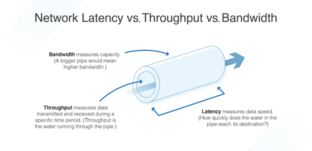

# Week 1 concepts

## Internet 

Network of networks. A worldwide interconnection of individual networks.   [Internet](https://glossary.atis.org/search-results/?search=+Internet+%5Bthe%5D)

## Host
End systems e.g. desktop computers, servers, mobile devices etc. Host sometimes divided into two categories: clients and servers.  Page 38

## Server 
Servers tend to be more powerful machines that store and distribute Web pages, stream video, relay e-mail, and so on.   Page 38

## Router
A router is a networking device that forwards data packets between computer networks. [Router](https://en.wikipedia.org/wiki/Router_(computing))
## Switch

A network switch is network hardware that connect devices on computer network by using packet switching to receive and forward data to the destination device.  [Swtich](https://en.wikipedia.org/wiki/Network_switch)

## Modem

A modem is a hardware device that converts data from a digital format into suitable for a transmission medium such as telephone lines or radio.  [Modem](https://en.wikipedia.org/wiki/Modem)

## Protocol

A protocol defines the format and the order of messages exchanged between two or more communicating entities, as well as the actions taken on the transmission and/or receipt of a message or the event. Page 35

## Network Core (network backbone)

The mesh of packet switches and links that interconnects the Internet's end systems.

## FDM 

Frequency-division multiplexing. The frequency spectrum of a link is divided up among the connections established across the link. Page 55

## TDM

Time-division multiplexing. Time is divided into frames of fixed duration, each frame is divided into fixed number of time slots. When the network establishes a connection across a link, the network dedicates one time slot in every frame to connection

## ISP

End systems access the Internet through Internet Service Providers. Page 30

## node delay 
As packet travels from one node(host or router) to the subsequent node(host or router) along this path, the packet suffers from several types of delays at each node along the path. The most important of these delays are the nodal **processing delay, queuing delay, transmission delay and propagation delay**. 

## TCP/IP protocol stack

It is conceptual model and set of communications protocols used in the Internet.  [TCP/IP](https://en.wikipedia.org/wiki/Internet_protocol_suite)

[TCP/IP protocol stack](week1_questions.md)

## Denial-of-service (DoS) 

Denial-of-service attack (DoS attack) is a cyber-attack in which the perpetrator seeks to make a machine or network resource unavailable to its intended users by temporarily or indefinitely disrupting services of a host connected to the Internet. Denial of service is typically accomplished by flooding the targeted machine or resource with superfluous requests in an attempt to overload systems and prevent some or all legitimate requests from being fulfilled. [DoS](https://en.wikipedia.org/wiki/Denial-of-service_attack)

## DDoS

Distributed denial-of-service attack, the incoming traffic flooding the victim originates from many different sources.  [DDoS](https://en.wikipedia.org/wiki/Denial-of-service_attack)

## Packet sniffing
Packet sniffing is the practice of gathering, collecting, and logging some or all packets that pass through a computer network, regardless of how the packet is addressed. In this way, every packet, or a defined subset of packets, may be gathered for further analysis.  [Packet sniffing](https://www.paessler.com/it-explained/packet-sniffing#:~:text=Packet%20sniffing%20is%20the%20practice,be%20gathered%20for%20further%20analysis.)

## Man-in-the-middle attack

Cyberattack where the attacker secretly relays and possibly alters the communications between two parties who believe that they are directly communicating with each other. 

[MITM](https://en.wikipedia.org/wiki/Man-in-the-middle_attack)

## Circuit switching

The switches on the path between the sender and receiver maintain connection state for that connection. In the jargon of telephony, this connection is called a circuit.

## End-to-end routing

The end-to-end routing process is analogous to a car driver who does not use maps but instead prefers to ask for directions. Page 53

## Link

The term *link* is widely used in computer networking to refer to the communications facilities that connect nodes of a network. [Link](https://en.wikipedia.org/wiki/Telecommunications_link#cite_note-2)

## Multiplexing

Multiplexing is a technique used to combine and send the multiple data streams over a single medium. [Mutiplexing](https://www.javatpoint.com/multiplexing-in-computer-network) 

## Throughput vs Bandwidth vs Latency

### Throughput

- rate **(bit/time unit)** at which bits are being send from sender to receiver
      - **instantaneous:** rate at given point in time(Many applications, including many P2P file sharing ­ systems, display the instantaneous throughput during downloads in the user interface)
      - **average:** rate over longer period of time
- Throughput is always less than or equal to bandwidth but can never exceed bandwidth. In a computer network, the throughput can be affected by many factors as listed below:
	- Network congestion due to heavy network usage.
	- Too many users are accessing the same server.
	- Low bandwidth allocation between network devices.
	- Medium loss of a computer network.
	- Resources (CPU, RAM) of network devices.
- So even if you have a high bandwidth to your ISP, it may not guarantee that you will have a high throughput due to the above factors.

### Bandwidth

In computer network, **bandwidth** is defined as the maximum number of bits that can flow through a network connection in a given period of time. The fundamental unit of network bandwidth is bits per second (bps).

An ISP network connection that specified a bandwidth of 1Mbps means that in one second, maximum 100000 bits can be transferred across this connection. The term bandwidth is normally used in internet broadband subscription plan. Normally a higher bandwidth subscription plan will cost more than that of a lower bandwidth subscription plan.

[Bandwidth](https://systemzone.net/network-bandwidth-and-throughput/)

### Latency

Latency measures **delay**. Delay is simply the time taken for a data packet to reach its destination after being sent. We measure network latency as round trips, although it may sometimes be measured in one-way trips. However, round-trip measurements are more common, because devices usually wait for an acknowledgment from the destination machine to be returned before transmitting the complete set of data. This acknowledgment verifies the connection to the destination device.

If your network is experiencing high levels of latency, this signals poor or slow network performance. In short, the higher your network delay and latency, the longer it will take for a data packet to reach the appropriate destination. The result of latency is often choppy and lagging services. This might manifest as poor-quality VoIP calls, where elements of speech are missing or there is a noticeable lag.

[Latency](https://www.dnsstuff.com/latency-throughput-bandwidth)