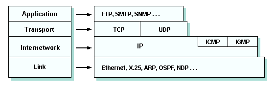

## Delay in a network node
**Which parts are included in the calculation of the delay in a network node?**
- Processing delay
- Queuing delay
- Transmission delay
- Propagation delay

## TCP/IP procotoal stack

**Which layers exist in the TCP/IP protocol stack?**

[TCP IP stack](https://www.technologyuk.net/computing/computer-networks/internet/tcp-ip-stack.shtml)

## Security

**What can threaten security in a system?**

- Viruses
- Worms
- Denial-of-service(DoS) attacks
	- Vulnerability attacks
    - Bandwidth flooding
    - Connection flooding
- Sniff Packets

