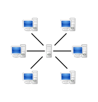

## Server Client 

In a **client-server architecture** , there is an always-on host, called the server, which services requests
from many other hosts, called clients.  Page 118

## P2P

**Peer-to-peer** (**P2P**) computing or networking is a [distributed application](https://en.wikipedia.org/wiki/Distributed_application) architecture that partitions tasks or workloads between peers. [P2P](https://en.wikipedia.org/wiki/Peer-to-peer). Peers make a portion of their resources, such as processing power, disk storage or network bandwidth, directly available to other network participants, without the need for central coordination by servers or stable hosts.[[1\]](https://en.wikipedia.org/wiki/Peer-to-peer#cite_note-1) Peers are both suppliers and consumers of resources, in contrast to the traditional [client-server](https://en.wikipedia.org/wiki/Client-server) model in which the consumption and supply of resources is divided.  

## Protocols in different Layer

## Port

A **port** is a communication endpoint. At the software level a port is a logical construct that **identifies a specific process**. [Port](https://en.wikipedia.org/wiki/Port_(computer_networking)) This information is needed because in general a host could be running many network applications.  Page 119

## Socket

A process sends messages into, and receives messages from, the network through a software interface called a socket. A process is analogous to a house and its socket is analogous to its door. Page 119.

## HTTP

The Web's applications protocol, HTTP, defines the format and sequence of messages exchanged between browsers and Web Server. HTTP is only one piece of the Web application. Page 126

## Persistent

All of the request and their corresponding responses is sent over the same TCP connection

## Non persistent

Each request/response pair is sent over separate TCP connection

## Cookies

Cookies allows sites to keep track of users.  Cookie technology has four components:

1. A cookie header line in the HTTP response message.
2. A cookie header line in the HTTP request message.
3. A cookie file kelp on the user's end system and managed by the user's browser.
4. A back-end database at the Website

Page 139

## Cache/Proxy Server

A Web cache - also called a proxy server - is a network entity that satisfies HTTP requests on the behalf of an origin Web server. The web cache has its own disk storage and keeps copies of recently requested objects in this storage. Web cache can substantially reduce the response time for a client request Web caches can substantially reduce traffic on an institution access link to the Internet.  Page 143

## Last modified

`Last-Modified` header is critical for object caching, both in the local client and in network cache servers(also known as proxy servers)

## SMTP

SMTP **Simple Mail Transfer Protocol** (**SMTP**)  is the principal application-layer protocol for Internet electronic mail. It uses the reliable data transfer service of **TCP to transfer mail** from sender's mail server to the recipient's mail server. Page 149

- SMTP is a push protocol

### IMAP and POP3

A user agent can’t use SMTP to obtain the messages because obtaining the messages is a pull operation, whereas SMTP is a push protocol. The puzzle is completed by introducing a special mail access protocol that transfers messages from a mail server to his local PC. There are currently a number of popular mail access protocols, including Post Office Protocol—Version 3 (POP3), Internet Mail Access Protocol (IMAP), and HTTP.

With POP3 access, once a user has downloaded his messages to the local machine, he can create mail folders and move the downloaded messages into the folders. A user can then delete messages, move messages across folders, and search for messages (by sender name or subject). But this paradigm— namely, folders and messages in the local machine—poses a problem for the nomadic user, who would prefer to maintain a folder hierarchy on a remote server that can be accessed from any computer. This is not possible with POP3—the POP3 protocol does not provide any means for a user to create remote folders and assign messages to folders. So nothing is synchronized. 

IMAP was designed with the goal of permitting complete management of an email box by multiple email clients, therefore clients generally leave messages on the server until the user explicitly deletes them.  All emails and folders are synchronized between multiple devices.  

## Stateless protocol
In computing, a stateless protocol is a communications protocol in which no session information is retained by the receiver, usually a server. [Stateless protocol](https://en.wikipedia.org/wiki/Stateless_protocol#:~:text=In%20computing%2C%20a%20stateless%20protocol,the%20receiver%2C%20usually%20a%20server.)
