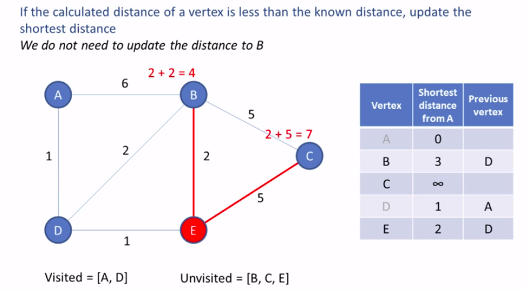

## Routing algorithms

### Centralized vs Decentralized

|                    | Centralized/Global                        | Decentralized                     |
| ------------------ | ----------------------------------------- | --------------------------------- |
| Protocol           | Link-state                                | Distance-vector                   |
| Algorithm          | Dijkstra                                  | Bellman-Ford                      |
| Principle          | Use global information about the network. | Iterative and distributed manner  |
| Input              | All nodes and all link cost.              | Only costs and DVs from neighbors |
| Info. sharing type | Broadcast                                 | Exchange                          |
| Control plane      | Per router / Logically centralized        | Per router                        |
| Convergence speed  | Faster                                    | Slower                            |
| Msg. complexity    | Smaller                                   | Larger                            |
| Robustness         | Higher                                    | Lower                             |

### Static vs Dynamic

| Static                                    | Dynamic                                                      |
| ----------------------------------------- | ------------------------------------------------------------ |
| Changes as a result of human intervention | Change the routing paths as the network traffic loads or topology changes or periodically |
|                                           | More vulnerable to problem such as routing loops and route oscillation |


### Costs
- Constant (e.g. 1)
- Bandwidth-Related
- Congestion-Related


## Dijkstra(Link State) 

### Intro

- Global Knowledge. 
  - In practice this is accomplished by having each node broadcast link-state packets to all other nodes in the network, with each link-state packet containing the identities and costs of its attached links 
- Goal
  - Find Least-Cost Paths
- Iterative
  - Locally with the same input data

### Notations

| Description                   | Notation |
| ----------------------------- | -------- |
| Link cost                     | c(x,y)   |
| Current cost to destination v | D(v)     |
| Predecessor Node on Path to v | p(v)     |
| Nodes with known path         | N'       |

### How does Djisktra Algorithm work?

- The main idea to keep the best path found until now and the reference to previous vertex.





```
Let distance of start vertex from start vertex = 0
Let distances of all other vertices from start = infinity

WHILE vertices remain unvisited
	Visit univisted vertex with smallest known distance from start vertex
	FOR EACH univisited neighbour of the current vertex
		Calculate the distance from start vertex
		IF the calculated distance of this vertex is less than the known distance
			Update shortest distance this vertex
			Update the previous vertex with the current vertex
        END IF
    Add the current vertex on the list of visited vertices
END WHILE
```


[Youtube Dijkstra algorithm](https://www.youtube.com/watch?v=pVfj6mxhdMw)


## Bellman - ford(Distant Vector)

- **Iterative** - in that this process continues on until no more information is exchanged between neighbors

- **Asynchronous** - it does not require all of the nodes to operate in lockstep with each other

- **Distributed** - each node receives some information from on or more of its directly attached neighbors 


The current node only know the distances to neighbors and the shortest paths to all other nodes from these neighbors.  By using this information and the equation below we can decide which path we should take:
$$
d_x(y) = min_v[c(x,v)+d_v(y)]
$$

| Annotation | Description                            |
| ---------- | -------------------------------------- |
| $c(x,v)$   | cost from x to v                       |
| $d_x(y)$   | cost of least-cost path from x to y    |
| $min_v$    | min is taken over all neighbors v of x |

That's, how much it will cost if I take through this node, because I know my distance to it and his distances to all other nodes.  Each neighbor see what his neighbors see. 


**B-F Equation example**


- $d_v(z)=5$
- $d_x(z)=3$
- $d_w(z)=3$

$$
d_x(y) = min_v[c(u,v)+d_v(z), c(u,x)+d_x(z), c(u,w)+d_w(z)] = \\
min_v[2+5, 1+3, 5+3] = 4
$$


**Maintains**

- $D_x=[D_x(y):y\in N]$ - Node x maintains its own distance vector
- $D_v=[D_v(y):y\in N]$ - Node x also maintains distance vectors for each neighbor v

*DV is big as nodes in the network*

**Overview**

- Send DV to Neighbors. 
- Update DV using B-F Equation
- Repeat


### What is count to infinity Problem?

- One of the important issue in Distance Vector Routing is County of Infinity Problem.
- Counting to infinity is just another name for a routing loop.
- In distance vector routing, routing loops usually occur when an interface goes down.
- It can also occur when two routers send updates to each other at the same time.


1.  As you see in this graph, there is only one link between A and the other parts of the network.
2.  Now imagine that the link between A and B is cut.
3. At this time, B corrects its table.
4. After a specific amount of time, routers exchange their tables, and so B receives C's routing table.
5. Since C doesn't know what has happened to the link between A and B, it says that it has a link to A with the weight of 2 (1 for C to B, and 1 for B to A -- it doesn't know B has no link to A).
6. B receives this table and thinks there is a separate link between C and A, so it corrects its table and changes infinity to 3 (1 for B to C, and 2 for C to A, as C said).
7.  Once again, routers exchange their tables.
8.  When C receives B's routing table, it sees that B has changed the weight of its link to A from 1 to 3, so C updates its table and changes the weight of the link to A to 4 (1 for C to B, and 3 for B to A, as B said).
9.  This process loops until all nodes find out that the weight of link to A is infinity.