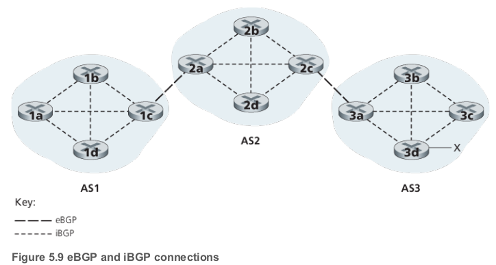
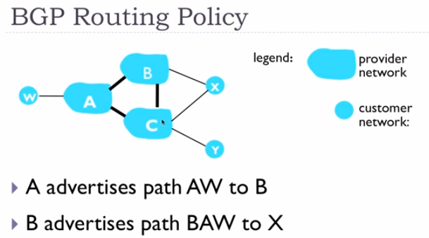

## Datagram

The Internet’s **network layer** is responsible for moving network-layer **packets** known as **datagrams** from
one host to another.

## Autonomous systems (ASs)

- Group of routers in a region

In order to solve scalability problems routers are organized into Autonomous Systems(**ASs**) with each AS consisting of a group of routers that are under the same administrative control. Routers within the same AS all run the same routing algorithm and have information about each other. 

## Why different Intra and Inter AS routing?

- Policy
  - We ant to enforce different policies on different levels of our netwroks
- Scale
  - Hierarchical routing in order to reduce the amount of updates we need to send everybody
  - Save table size
- Performance
  - In Intra performance is really important
  - In Inter maybe policy would be more important than performance

## Intra AS routing

- **Intra**- is a prefix which means within or inside one group.

- Intra autonomous system is the routing algorithm running within an AS
- Routers in the same AS have to run the same routing protocols 

### **Common Intra-AS Routing protocols/ Interior gateway protocol** 

#### RIP: Routing Information Protocol

- Distance Vector Algorithm
- Distance Metric
  - number of hops (number of subnets)
  - max = 15hops
  - Response Message (or Advertisements) - sends DV 
  - Link Failure and Recovery: No Advertisement in 180sec = You're Dead
- RIP table processing
  - route**d**
    - UDP advertisiments

#### OSPF: Open Shortest Path First

- Link state
  - Dijkstra algorithm
- Advertisements
  - Straight IP datagrams, not UDP
- Security
  - All messages authenticated
- Multiple same cost paths
- Multiple cost metrics
- Integrated multicast
  - multiple messages to multiple recipients
- Hierarchical OSPF
  - 2 level Hierarchy
  - Local Area
  - Backbone

#### EIGRP: Enhanced Interior Gateway Routing Protocol

## Inter AS routing

- **Inter**- is a prefix that means between two groups

Routers in different ASs could run on different routing protocols 

### BGP

- Routing among the ISPs

- Border Gateway Protocol
- The de facto standard
- Allows AS to
  - Obtain Subnet Reachability Information
  - Propagate Reachability Information to Internal Routers
  - Determine Good Routes to External Subnets
    - Reachability information
    - Policy
- Destinations are prefixes NOT Hosts   
- Prefix + Attributes = Route

  - Advertised prefix includes BGP attributes
  - 2 Important Attributes
    - AS-PATH - path of AS that you have to pass in order to get to this prefix
    - NEXT-HOP - IP address of the router interface that begins the AS-PATH
- Route Selection
1. Local Preferences Value Attribute: Policy Decision
  2. Shortest AS-PATH
  3. Closest NEXT-HOP router: Hot potato routing
  4. Additional criteria
- BGP Messages
  - Messages exchanged using TCP
  - Types
    - OPEN: opens TCP connection to peer and authenticate sender
    - UPDATE: advertises new path(or withdraws old)
    - KEEPALIVE: keeps connection alive in absence of UPDATES; also ACKs OPEN request
    - NOTIFICATION: reports error in previous msg, also used to close connection
    - 

### iBGP vs eBGP

- BGP Peer
  - BGP neighbors, called peers, are established by manual configuration among routers  to create a TCP session on port 179. 
- Two differenr BGP Sessions:

| iBGP                                                         | eBGP                                              |
| ------------------------------------------------------------ | ------------------------------------------------- |
| *Internal BGP*                                               | External BGP                                      |
| When BGP runs between two peers in the same [autonomous system](https://en.wikipedia.org/wiki/Autonomous_system_(Internet)) (AS) | When it runs between different autonomous systems |

### BGP Routing Policy

- B shouldn't advertise path BAW to C, because B does not want to provide service for C when C can be get through A , so any routes that can be gotten to through other means we'd prefer that, because then B wasting its bandwidth

## Gateway routers
- Router that connects ASs 
- have to use them if we have external destination 

## Hot Potato Routing

One of the simplest BGP routing algorithms

## ICMP

- **Internet control message protocol** is used by hosts and routers to communicate network layer information to each other. The most typical use of ICMP is for error reporting

## SNMP

SNMP is an application-layer protocol used to convey netwrokd-management control and information messages between a managing server and an agent executing on behalf of the managing server

## SDN

**Software-defined networking** (**SDN**) technology is an approach to network management that enables dynamic, programmatically efficient network configuration in order to improve network performance and monitoring, making it more like cloud computing than traditional network management

Key characteristics of an SDN architecture:

- **Packet forwarding can be based on any number of header fields.** 
  - Rules are specified in a switch's flow table; it is the job of the SDN control plane to compute, manage and install flow table entries in all of the network switches
- **Separation of data plane and control plane**
  - The data plane consists of the network switches- relatively simple(but fast) devices that execute the "match+action" rules in their flow tables.
  - The control plane consists of servers and software that determine and manage the switches flow table
- **Network control functions: external to data-plane switches**
  - The control plane itself consists of two components
    - **SDN controller** - maintains accurate network state information
    - **Set of network control applications** - Access control, Routing, Load balancer

- **Programmable network**
  - The network is programmable through the network control applications running in the control plane. E.g. routing with Dijkstra algorithm 

That's data plane switches, SDN controllers and network control applications are separate entities.

- A controllers functionality can be organized into three layers:

## Forwarding
Forwarding has two main operations: match and action.

## Match + action

- Match bits in arriving packet, take action

| Destination based forwarding      | Generalized forwarding                             |
| --------------------------------- | -------------------------------------------------- |
| Forward based on dest. IP address | Many headers can determine action                  |
|                                   | Many actions possible: drop/copy/modify/log packet |

## Generalized forwarding

- Replaces Decision based forwarding
- Many more fields than destination address can be consulted and much wider range of actions
- Match+action
- OpenFlow - emerging standard for generalized forwarding

|              | Simple packet handling rules                                 |
| ------------ | ------------------------------------------------------------ |
| **Match**    | Pattern values in packet header fields                       |
| **Actions**  | For matched packet: drop, forward, modify(e.g. NAT), matched packet or send matched packet to controller |
| **Priority** | Disambiguate overlapping patterns                            |
| **Counters** | #bytes and #packets                                          |

## OpenFlow

- Specific generalized  forwarding, that has been standardized
- Unifies different kinds of devices

| Device       | Match                                 | Action                   |
| ------------ | ------------------------------------- | ------------------------ |
| **Router**   | Longest destination IP prefix         | Forward out a link       |
| **Switch**   | Destination MAC address               | Forward or flood         |
| **Firewall** | IP addresses and TCP/UDP port numbers | Permit or dent           |
| **NAT**      | IP address and port                   | Rewrite address and port |

- No need for routing protocols, because forwarding tables are computes in the SDN controller

