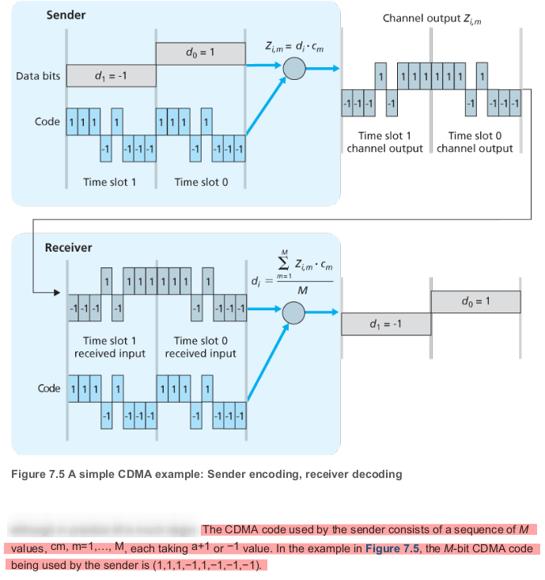
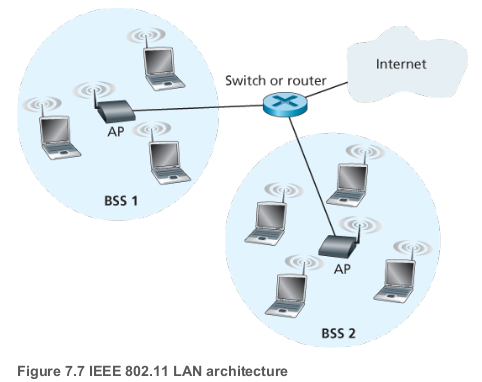
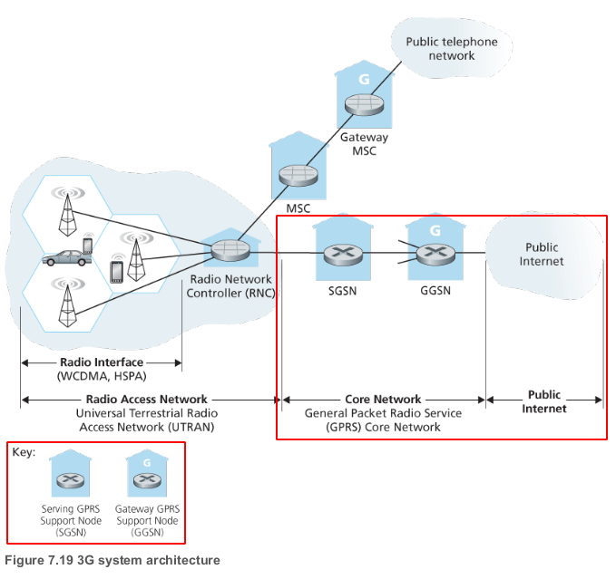
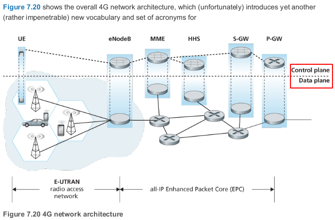
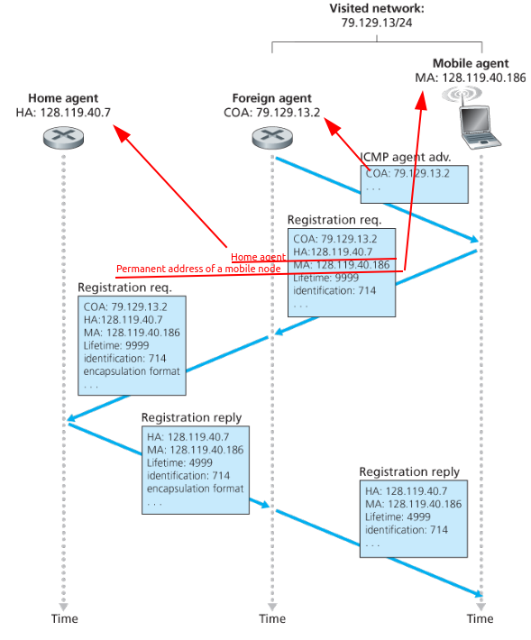
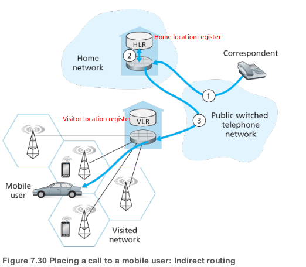

# Wireless

## Modes

| Infrastructure                                           | Ad-hoc network                                               |
| -------------------------------------------------------- | ------------------------------------------------------------ |
| Hosts associated with a base station                     | No such infrastructure                                       |
| Host can only communicate with base, not with each other | Hosts themselves must provide for services such as routing, address assignment, DNS-like name translation, |

|                                     | Single hop                                                   | Multiple hops                                                |
| ----------------------------------- | ------------------------------------------------------------ | ------------------------------------------------------------ |
| **Infrastructure**   (e.g., APs) | Hosts connects to base station(WiFi, cellular, WiMAX) which connects to larger Internet | Host may have to relay through several wireless nodes to connect to larger Internet: *mesh net* |
| **No infrastructure**               | No base station, no connection to larger Internet(Bluetooth, ad hoc nets) | No base station, no connection to larger Internet. May have to relay to reach other a given wireless node MANET, VANET |

## CDMA

- Code division multiple access
- Channel partitioning protocol

## WiFi

- IEEE 802.11 wireless LAN

### IEEE 802.11 standards

- All 802.11 standards share some **common strcuture**:
	-  All use the same medium access protocol, CSMA/CA
	-  The same frame structure for their link-layer frames
	-  The ability to reduce their transmission rate in order to reach out over greater distances
	-  All backwards compatible
- Differences in physical layer

| Standard | Frequency Range   | Data rate       | Description                                                  |
| -------- | ----------------- | --------------- | ------------------------------------------------------------ |
| 802.11b  | 2.4 GHz           | up to 11 Mps    | Unlicensed frequency band, may compete for frequency spectrum with 2.4 GHz phones and microwave ovens. |
| 802.11a  | 5 GHz             | up to 54 Mbps   | Have a shorter transmission distance for a given power level and suffer more from multipath propagation |
| 802.11g  | 2.4 GHz           | up to 54 Mbps   | Again 2.4 GHz                                                |
| 802.11n  | 2.5 GHz and 5 GHz | up to 450 Mbps  | uses multiple input multiple-output (MIMO) antennas i.e., two or more antennas on the sending side and two or more antennas on the receiving side that are transmitting/receiving different signals |
| 802.11ac | 5 GHz             | up to 1300 Mbps | MIMO. Stations also may transmit to multiple stations simultaneously, and use “smart” antennas to adaptively beamform to target transmissions in the direction of a receiver. This decreases interference and increases the distance reached at a given data rate |

## Mobile Networks

- Natural strategy is to extend cellular networks so that they support not only voice telephony but wireless Internet access as well. Ideally, this Internet access would be at a reasonably high speed and would provide for seamless mobility, allowing users to **maintain their TCP sessions while traveling**.

## 3G

- Goal: leave the existing core GSM cellular voice network untouched, adding additional cellular data functionality in parallel to the existing cellular voice network.

| SGSN                                                         | GGSN                                                         |
| ------------------------------------------------------------ | ------------------------------------------------------------ |
| interacts with the cellular voice network’s MSC for that area | acts as a gateway                                            |
| Providing user authorization and handoff                     | connecting multiple SGSNs into the larger Internet.          |
| maintaining location (cell) information about active mobile nodes | To the outside world, the GGSN looks like any other gateway route |
| **performing datagram forwarding** between mobile nodes in the radio access network and a GGSN | the mobility of the 3G nodes within the GGSN’s network is hidden from the outside world behind the GGSN. |

- The **RNC** connects to both the circuit-switched cellular voice network via an MSC, and to the packet-switched Internet via an SGSN. Thus, while 3G cellular voice and cellular data services use different core networks, they share a common first/last-hop radio access network

### LTE

- As know as 4G LTE (Long-Term Evolution)
- Two important innovations over 3G system
	- All-IP core network - both voice and data are carried in IP datagrams to/from the wireless device
	- Enhanced radio access network - uses a **combination of frequency division multiplexing and time division multiplexing** on the downstream channel, known as orthogonal frequency division multiplexing (OFDM) 

## Mobile IP

The mobile IP standard consists of three main pieces:

- **Agent discovery** 
- **Registration with the home agent**
- **Indirect routing of datagrams**

- Figure 7.29 Agent advertisement and mobile IP registration

## Mobile Cellular networks

- Like mobile IP, GSM adopts an indirect routing approach, first routing the correspondent’s call to the mobile user’s home network and from there to the visited network

